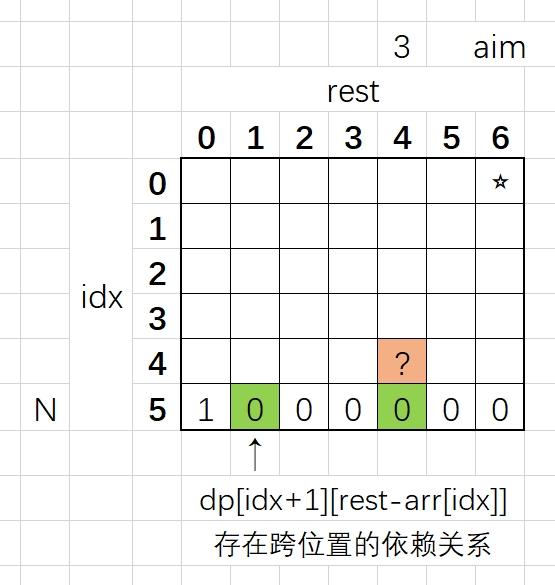
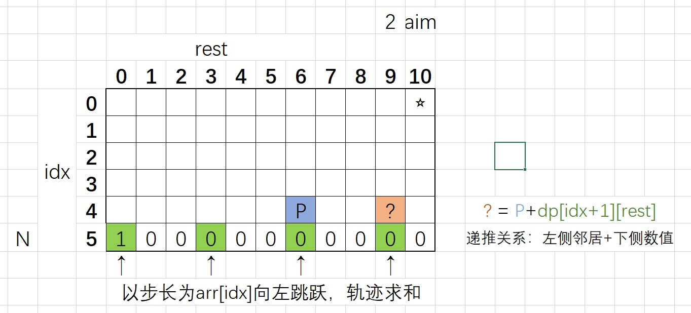

# 动态规划的定义
如果发现有`计算的重复过程`，动态规划在计算完一次之后将答案保存，下次再遇到重复计算过程则直接调用。
这个行为就叫动态规划，没有别的。

以斐波那契数列为例：
1. `递归尝试过程`：递归的计算方法是一个尝试过程。这个尝试过程存在大量的重复运算，因为一个高度为N的二叉树需要全部展开。
```c++
int f(int N) {
    if (N == 1) return 1;
    if (N == 2) return 1;
    return f(N - 1) + f(N - 2); // 通项公式
}
```
2. `缓存改进方法`：能否把中间结果使用表格记录下来，下次遇到直接取数即可，不再另行计算。就是缓存机制，空间换时间。

3. `正向递推方法`：不使用尝试的方法，正向递推。复杂度和缓存改进方法是一样的。

# 从暴力递归到动态规划
一定从尝试入手，把尝试写出来以后，动态规划是水到渠成的。如果我作为一个傻白甜，如何把`暴力递归`的版本写出来。

`暴力递归改DP的条件`：必须有重复的子过程，如果没有子过程，不能优化。

`真正有魅力的地方`：用人的自然智慧把尝试过程写出来。

`关于改DP的方法`：和原始的业务问题没有任何关联，是严格位置依赖的Coding问题。

`为什么一定要找严格位置依赖`：因为有很多优化过程是必须基于严格位置依赖的。

# 动态规划题目分类
1. `从左往右的尝试模型`：在[0, N]范围上依次尝试；
2. `范围尝试模型`：在[L, R]范围上进行尝试；
3. `样本对应模型`：一个样本做行，一个样本做列。`特别特别`喜欢讨论末尾位置划分可能性，这就是思想传统；
4. `业务限制模型`：可变参数范围无法明确，使用业务最差情况估计。

# 动态规划优化技巧
1. `斜率优化`：观察临近格子的枚举行为，省略掉for循环；

# 题目1: 机器人运动
```python
总位置：1..N
机器人起始位置：Start
目标位置：Aim
移动步数：K

运动规则：如果在2..N-1位置，可以双向移动；如果在1或N位置，只能调头移动。
问题：从Start开始走K步刚好到Aim的方法数量
```

**最关键的是**：暴力递归把整个过程尝试出来。
```c++
/* V1. 暴力递归进行尝试 */
// 递归含义：从cur开始，还剩rest步，最后刚好在aim的方法数量
int process(int N, int aim, int cur, int rest) {
    // BaseCase: 没有步数可走了，若最后刚好走到aim返回1，否则返回0
    if (rest == 0) {
        return cur == aim ? 1 : 0;
    }
    // NormalCase: 开始枚举可能性
    if (cur == 1) { // 到最左侧，只能往右侧走
        return process(N, aim, cur + 1, rest - 1);
    } 
    if (cur == N) { // 到最右侧，只能往左侧走
        return process(N, aim, cur - 1, rest - 1);
    }
    // 否则是中间的位置，左右两侧都可以走
    return process(N, aim, cur + 1, rest - 1) + process(N, aim, cur - 1, rest - 1);
}
int ways1(int N, int aim, int start, int K) {
    return process(N, aim, start, K);
}
```

**关键分析**：
1. 此递归过程只由两个参数决定(cur, rest);
2. 由(7, 10)向两侧移动出来(6, 9)和(8, 9)，继续移动会出两个(7, 8)，出现重复计算；
3. 两个(7, 8)和之前移动无关，只和当前状态有关；
4. 有重复过程则`有利可图`。

```c++
/* V2. 傻缓存版本 */
// 又称为从顶向下的DP，记忆化搜索，不关心严格位置依赖。
// 这其实已经是动态规划了。

// cur范围: [1..N]
// rest范围: [0..K]
int process(int N, int aim, int cur, int rest, vector<vector<int>>& dp) {
    // 之前算过，命中缓存
    if (dp[cur][rest] != -1){ 
        return dp[cur][rest];
    }
    // 之前没算过，计算并添加到缓存中
    int ans = 0;
    if (rest == 0) {
        ans = cur == aim ? 1 : 0;
    } else if (cur == 1) {
        ans = process(N, aim, cur + 1, rest - 1, dp);
    }  else if (cur == N) {
        ans = process(N, aim, cur - 1, rest - 1, dp);
    } else {
        ans = process(N, aim, cur + 1, rest - 1, dp) + process(N, aim, cur - 1, rest - 1, dp);
    }
    dp[cur][rest] = ans; // 结果塞到缓存里面
    return ans;
}
int ways2(int N, int aim, int start, int K) {
    // dp[N+1][K+1]能够装下所有值
    vector<vector<int>> dp(N+1, vector<int>(K+1, -1)); // 初始化为-1，表示没有填过
    return process(N, aim, start, K, dp);
}
```

```c++
/* V3. DP填表版本 */
// 画图找依赖关系，看怎么样填表能够满足依赖。其实这一步已经不是DP问题而是coding问题了。
int ways2(int N, int aim, int start, int K) {
    // dp[N+1][K+1]能够装下所有值
    vector<vector<int>> dp(N + 1, vector<int>(K + 1, 0)); // 初始化为0
    // i范围: [1..N]  j范围: [0..K]
    dp[aim][0] = 1; // 先把第一列填好
    for (int rest = 1; rest <= K; rest++) { // 从第二列开始处理，按照列进行竖向扫描
        for (int cur = 1; cur <= N; cur++) {
            if (cur == 1) {
                dp[cur][rest] = dp[cur + 1][rest - 1];
            } else if (cur == N) {
                dp[cur][rest] = dp[cur - 1][rest - 1];
            } else {
                dp[cur][rest] = dp[cur + 1][rest - 1] + dp[cur - 1][rest - 1];
            }
        }
    }
    return dp[start][K];
}
```

```c++
/* V4. DP填表优化版本 */
// 将列方向上的初始和结尾位置跳过单独计算，省去if判断。
int ways2(int N, int aim, int start, int K) {
    // 过滤条件
    if (N < 2 || start < 1 || start > N || aim > N || K < 1) return -1;
    vector<vector<int>> dp(N + 1, vector<int>(K + 1, 0)); // 初始化为0
    // cur范围: [1..N]  rest范围: [0..K]
    dp[aim][0] = 1; // 先把第一列填好
    for (int rest = 1; rest <= K; rest++) {
        dp[1][rest] = dp[2][rest - 1]; // 特殊位置直接设置
        for (int cur = 2; cur < N; cur++) {
            dp[cur][rest] = dp[cur + 1][rest - 1] + dp[cur - 1][rest - 1];
        }
        dp[N][rest] = dp[N - 1][rest - 1];
    }
    return dp[start][K];
}
```


# 题目2: 先手后手拿牌
```python
给定一个整型数组arr，代表数值不同的纸牌排成一条线，   玩家A和玩家B依次拿走每张纸牌，   
规定玩家A先拿，玩家B后拿，   
但是每个玩家每次只能拿走最左或最右的纸牌，   
玩家A和玩家B都绝顶聪明。请返回最后获胜者的分数
```

这个题目可太有意思了...

我是先手，我在[L...R]范围内获得到的最好分数是多少，请用`int f(arr, L, R)`返回。
1. 如果L==R，只剩下一张牌，我是先手所以直接拿走。
2. 拿左侧牌，则获取到的金额为`arr[L] + g(arr, L+1, R)`
3. 拿右侧牌，则获取到的金额为`arr[R] + g(arr, L, R-1)`
4. 因为自己是先手，所以上面两个结果取max

我是后手，我在[L...R]范围内获得到的最好分数是多少，请用`int g(arr, L, R)`返回。
1. 如果L==R，只剩下一张牌，我是后手获得0。
2. 对方拿走了L，后面轮到自己先手，获得`f(arr, L+1, R)`
3. 对方拿走了R，后面轮到自己先手，获得`f(arr, L, R-1)`
4. 因为自己是后手，所以上面两个结果取min

```c++
/* V1. 暴力递归进行尝试 */
int win(vector<int>& arr) {
    if (arr == NULL || arr.size() == 0) {
        return 0;
    }
    int first = f(arr, 0, arr.size()-1); // 先手尝试
    int second = g(arr, 0, arr.size()-1); // 后手尝试
    return max(first, second);
}
// arr[L..R]，先手获得最好分数返回
int f(vector<int>& arr, int L, int R) {
    if (L == R) {
        return arr[L];
    }
    int p1 = arr[L] + g(arr, L+1, R); // 我自己拿arr[L]
    int p2 = arr[R] + g(arr, L, R-1); // 我自己拿arr[R]
    return max(p1, p2); // 主动挑选最大
}
// arr[L..R]，后手获得最差分数返回
int g(vector<int>& arr, int L, int R) {
    if (L == R) {
        return 0;
    }
    int p1 = f(arr, L+1, R); // 别人拿arr[L]
    int p2 = f(arr, L, R-1); // 别人拿arr[R]
    return min(p1, p2); // 无奈选择
}
```

关键分析：展开找到了重复的解
1. f(0, 7) => g(1, 7) g(0, 6)
2. g(1, 7) => f(1, 6) f(2, 7)
3. g(0, 6) => f(1, 6) f(0, 5)

```c++
/* V2. 傻缓存版本 */
int win(vector<int>& arr) {
    if (arr == NULL || arr.size() == 0) {
        return 0;
    }
    // N长度可以装下[0..N-1]
    vector<vector<int>> fmap(N, vector<int>(N, -1));
    vector<vector<int>> gmap(N, vector<int>(N, -1));

    int first = f(arr, 0, arr.size()-1, fmap, gmap); // 先手尝试
    int second = g(arr, 0, arr.size()-1, fmap, gmap); // 后手尝试
    return max(first, second);
}
// arr[L..R]，先手获得最好分数返回
int f(vector<int>& arr, int L, int R, vector<vector<int>>& fmap, vector<vector<int>>& gmap) {
    // 能够查表，直接返回
    if (fmap[L][R] != -1) {
        return fmap[L][R];
    }
    // 不能查表，计算并且塞数值
    int ans = 0;
    if (L == R) {
        ans = arr[L];
    } else {
        int p1 = arr[L] + g(arr, L+1, R, fmap, gmap); // 我自己拿arr[L]
        int p2 = arr[R] + g(arr, L, R-1, fmap, gmap); // 我自己拿arr[R]
        ans = max(p1, p2);
    }
    fmap[L][R] = ans;
    return ans;
}
// arr[L..R]，后手获得最差分数返回
int g(vector<int>& arr, int L, int R, vector<vector<int>>& fmap, vector<vector<int>>& gmap) {
    // 能够查表，直接返回
    if (gmap[L][R] != -1) {
        return gmap[L][R];
    }
    // 不能查表，计算并且塞数值
    int ans = 0;
    if (L == R) {
        ans = 0;
    } else {
        int p1 = f(arr, L+1, R, fmap, gmap); // 别人拿arr[L]
        int p2 = f(arr, L, R-1, fmap, gmap); // 别人拿arr[R]
        ans = min(p1, p2);
    }
    gmap[L][R] = ans;
    return ans; // 无奈选择
}
```

基于傻缓存版本，进行空间位置的严格依赖分析，推导出最终的解。
```c++
/* V3. DP填表版本 */
int win(vector<int>& arr) {
    if (arr == NULL || arr.size() == 0) {
        return 0;
    }
    // 准备DP表
    vector<vector<int>> fmap(N, vector<int>(N, -1));
    vector<vector<int>> gmap(N, vector<int>(N, -1));
    // 开始填表:对角线位置
    for (int i=0; i<N; i++) {
        fmap[i][i] = arr[i];
        gmap[i][i] = 0;
    }
    // 开始填表:右上角部分
    for (int i=1; i<N; i++) {
        for (int j=0; j<N-i; j++) {
            // 神奇的相互依赖关系
            fmap[i][j] = max(arr[i] + gmap[i+1][j], arr[j] + gmap[i][j-1]);
            gmap[i][j] = max(fmap[i+1][j], fmap[i][j-1]);
        }
    }
    return max(fmap[0][N-1], gmap[0][N-1]); // 确定输出结果的可变参数
}
```


# 题目3: 背包能装下最多的价值
```python
给定两个长度都为N的数组weights和values，weights[i]和values[i]分别代表 i号物品的重量和价值。
给定一个正数bag，表示一个载重bag的袋子，
你装的物品不能超过这个重量。
返回你能装下最多的价值是多少?
```

经典`从左往右尝试模型`，在每个物品的位置考虑要和不要，不能够超过容量限制。
有一个bag为负数的大坑，无效解过滤技巧在之后会经常用到。

```c++
/* V1. 递归的错误版本 */
// 返回不超重的最大价值
int maxValue(vector<int> w, vector<int> v, int bag) {
    if (w == NULL || v == NULL || w.size() != v.size()) {
        return 0;
    }
    return process(w, v, 0, bag); // 从0开始尝试
}
// 当前考虑到了index号货物，从index出发所有货物都可以自由选择，返回最大价值。不能超过容量。
int process(vector<int> w, vector<int> v, int index, int rest) {
    // BaseCase
    if (rest < 0) { // 超重，一定不是一个合理的方案。注意！当bag=0时，可以继续装w=0的货。
        return 0; 
    }
    if (index == w.size()) { // 到达越界位置，返回0
        return 0;
    }
    // NormalCase
    int p1 = v[index] + process(w, v, index + 1, rest - w[index]); // 要当前货物，容量减小
    int p2 = process(w, v, index + 1, rest); // 不要当前货物，容量不变
    return max(p1, p2);
}
```
这个版本的代码会在背包无效时返回错误结果。
例如w=[7], v=[15], bag=6, 在要第一个货物之后，f(1, -1)会产生无效解，所以需要过滤。
因此要在产生无效解的时候传递信息给上层。

```c++
/* V1. 正确递归版本 */
int process(vector<int> w, vector<int> v, int index, int rest) {
    // BaseCase
    if (rest < 0) { // 超重产生无效解，需要过滤。
        return -1; 
    }
    if (index == w.size()) { // 到达越界位置，返回0
        return 0;
    }
    // NormalCase
    int p1 = process(w, v, index + 1, rest); // 不要当前货物，容量不变
    int p2 = 0;
    int next = process(w, v, index + 1, rest - w[index]); // 先调用，假设要当前货物，看是否违规
    if (next != -1) { // 不违规才参与运算
        p2 = v[index] + next; // 有效的后续
    }
    
    return max(p1, p2);
}
```
w=[3, 2, 5, ...], v=[7, 4, 6, ...] 这样的情况下，要[0][1]不要[2]和不要[0][1]要[2]都会产生一个f(3, bag-5)的项，产生了重复计算。所以有利可图。

```c++
/* V2. 动态规划-填表 */
int maxValue(vector<int> w, vector<int> v, int bag) {
    if (w == NULL || v == NULL || w.size() != v.size()) {
        return 0;
    }
    // index范围: 0 ~ N 
    // rest范围: 0 ~ bag 
    vector<vector<int>> dp(w.size(), vector<int>(bag+1, 0)); // dp[N+1][bag+1]能够装下
    // rest < 0时是-1的海洋，填表时需要逻辑判断
    // idx = N时全为0
    for (int index = N-1; index >= 0; index--) {
        for (int rest = 0; rest <= bag; rest++) {
            // 从尝试过程直接抄过来
            int p1 = dp[index + 1][rest];
            int p2 = 0;
            int next = rest - w[index] < 0 ? -1 : dp[index + 1][rest - w[index]]; // 提前判断是否越界
            if (next != -1) {
                p2 = v[index] + next;
            }
            dp[index][rest] = max(p1, p2);
        }
    }
    return dp[0][bag];
}
```

# 题目4: 数字转化为字符串的结果数
```
规定1和A对应、2和B对应、3和C对应...  那么一个数字字符串比如"111”就可以转化为:  
"AAA"、"KA"和"AK"  
给定一个只有数字字符组成的字符串str，返回有多少种转化结果
```

```c++
/* V1. 暴力递归进行尝试 */
// str[0..i-1]位置上已经无需过问
// str[i...]去转化，返回有多少种转化方法
int process(string str, int i) {
    if (i == str.size()) {
        return 1; // 如果到达了越界位置，则有一种可能性
    }
    if (str[i] == '0') {
        return 0; // 如果独自面对0，决策有问题，转化失败
    }
    int ways = process(str, i + 1); // 非0，可以单转
    if (i + 1 < str.size() && (str[i] - '0') * 10 + (str[i + 1] - '0') < 27) { 
        // 可以双转，而且合法，添加上这种可能性
        ways += process(str, i + 2);
    }
    return ways;
}
```

```c++
/* V2. DP填表版本 */
int dp(string str) {
    int N = str.size();
    vector<int> dp(N + 1, 0); // 只有一个可变参数，所以是一维
    dp[N] = 1;

    for (int i=N-1; i>=0; i--) { // 以下部分都是抄过来的
        if (str[i] == '0') {
            dp[i] = 0;
        } else {
            int ways = dp[i + 1]; // 非0，可以单转
            if (i + 1 < str.size() && (str[i] - '0') * 10 + (str[i + 1] - '0') < 27) { 
                ways += dp[i + 2];
            }
            dp[i] = ways; // 递归函数返回
        }
    }

    return dp[0];
}
```

# 题目5: 691.贴纸拼词[Hard]
https://leetcode.cn/problems/stickers-to-spell-word/

```python
给定一个字符串str，给定一个字符串类型的数组arr。
arr里的每一个字符串，代表一张贴纸，你可以把单个字符剪开使用，目的是拼出str来。
返回需要至少多少张贴纸可以完成这个任务。
例子：str= "babac"，arr = {"ba","c","abcd"}
至少需要两张贴纸"ba"和"abcd"，因为使用这两张贴纸，把每一个字符单独剪开，含有2个a、2个b、1个c。是可以拼出str的。所以返回2。
```

**思路**：在每一层都使用所有贴纸进行尝试，直到字符串清空。

**不需要搞成严格表结构的DP**：代表性题目。可变参数的范围无法确定，或空间太大无法囊括。所以要做傻缓存（记忆化搜索）进行记录。
```c++
/* V1：暴力递归直接尝试 */
int minStickers(vector<string>& stickers, string target) {
    int ans = process(stickers, target);
    return ans == INT_MAX ? -1 : ans;
}

// 清空所有字符，返回最少需要多少张
int process(vector<string>& stickers, string target) {
    if (target.size() == 0) {
        return 0; // 没了当然返回0张
    }
    // 每张贴纸依次尝试
    int minNum = INT_MAX;
    for (auto& sti : stickers) {
        string mimus = strMinus(target, sti);
        if (mimus.size() != target.size()) { // 能消掉字符，才使用
            // 理解要停留在process的功能层次，不然会乱掉
            // minNum = min(minNum, 1 + process(stickers, mimus)); // 这样不行，会MAX+1，必须结尾+1
            int curAns = process(stickers, mimus);
            if (curAns != INT_MAX) { // 后续有解，才考虑更新min，否则直接跳过
                minNum = min(minNum, 1 + curAns); 
            }
        }
    }
    return minNum;
}

// 字符串减法
string strMinus(string& target, string& sti) {
    vector<int> rec(26, 0);
    for (char& ch : target) {
        rec[ch - 'a']++;
    }
    for (char& ch : sti) {
        rec[ch - 'a']--;
    }
    string res = "";
    for (int idx = 0; idx < rec.size(); idx++) {
        if (rec[idx] <= 0) continue;
        for (int i = 0; i < rec[idx]; i++) {
            res = res + (char)('a' + idx);
        }
    }
    return res;
}
```

**重要贪心优化**：排序后的字符串中，先尝试有首个字母的字符，不会影响最终答案。通过剪枝操作。本质上利用了减法的无序性，总有消掉这个字符的时刻。

**记忆化搜索**：因为可变参数的空间过于复杂，不能进行模拟，所以直接使用哈希表完成记忆化搜索。

```c++
/* V2：贪心DP优化 & 记忆化搜索（击败73.13%） */
int minStickers(vector<string>& stickers, string& target) {
    map<string, int> dp;
    sort(target.begin(), target.end()); // 升序排列
    int ans = process3(stickers, target, dp);
    return ans == INT_MAX ? -1 : ans;
}

// 清空所有字符，返回最少需要多少张
int process3(vector<string>& stickers, string& target, map<string, int>& dp) {
    if (target.size() == 0) {
        return 0; // 没了当然返回0张
    }
    // 有值则直接返回
    if (dp.count(target) != 0) {
        return dp[target];
    }
    // 每张贴纸依次尝试
    int minNum = INT_MAX;
    for (auto& sti : stickers) {
        // 重要贪心优化：只有sti包含target首字母才进行尝试，没有的话只能打败5%
        if (!checkChar(target[0], sti)) continue;
        string mimus = strMinus(target, sti);
        int curAns = process3(stickers, mimus, dp);
        if (curAns != INT_MAX) {
            minNum = min(minNum, 1 + curAns); 
        }
    }
    // 返回前塞进缓存
    dp[target] = minNum;
    return minNum;
}

bool checkChar(char& tgt, string& sti) {
    // sti中含有tgt字符就返回ture，否则返回false
    for (char& ch : sti) {
        if (ch == tgt) {
            return true;
        }
    }
    return false;
}
```


# 题目6: 1143.最长公共子序列(经典样本对应)[Medium]
https://leetcode.cn/problems/longest-common-subsequence/

LCS问题，还是有一点点绕的。

**思路**：只关心str1[0...i]和str2[0...j]的最长公共子序列是多长，从i+1和j+1位置开始统统不看。
1. 分析越界的边界：同时=0越界、i=0越界、j=0越界。
2. 正常条件：分为四种情况，完全不考虑i&&完全不考虑j、考虑i&&完全不考虑j、完全不考虑i&&考虑j、考虑i&&考虑j。
3. 讨论方式：如果要“一定以i位置结尾”，那么就要判断i位置字符是否出现过，会遍历字符串，很难处理。

**样本对应模型**：通常都是对两个样本的结尾进行可能性讨论（经验） 。后面还有很多这种类型的题目。

```c++
/* V1. 暴力递归 */
int longestCommonSubsequence1(string text1, string text2) {
    return process1(text1, text2, text1.size() - 1, text2.size() - 1);
}

// str1[0..i]和str2[0..j]，返回最长公共子序列的长度是多少
int process1(string str1, string str2, int i, int j) {
    if (i == 0 && j == 0) {
        return str1[i] == str2[j] ? 1 : 0;
    } else if (i == 0) {
        return str1[i] == str2[j] ? 1 : process1(str1, str2, i, j - 1);
    } else if (j == 0) {
        return str1[i] == str2[j] ? 1 : process1(str1, str2, i - 1, j);
    }
    // 正常情况，末尾讨论
    int p1 = process1(str1, str2, i - 1, j - 1) + (str1[i] == str2[j] ? 1 : 0);
    int p2 = process1(str1, str2, i, j - 1);
    int p3 = process1(str1, str2, i - 1, j);
    return max(max(p1, p2), p3);
}
```

```c++
/* V2. 动态规划 */
int longestCommonSubsequence(string str1, string str2) {
    int N = str1.size();
    int M = str2.size();
    vector<vector<int>> dp(N, vector<int>(M, -1));
    // 开始填表
    dp[0][0] = str1[0] == str2[0] ? 1 : 0;
    for (int j=1; j<M; j++) {
        dp[0][j] = str1[0] == str2[j] ? 1 : dp[0][j-1];
    }
    for (int i=1; i<N; i++) {
        dp[i][0] = str1[i] == str2[0] ? 1 : dp[i-1][0];
    }
    for (int i=1; i<N; i++) {
        for (int j=1; j<M; j++) { // 直接从暴力递归抄过来
            int p1 = dp[i-1][j-1] + (str1[i] == str2[j] ? 1 : 0);
            int p2 = dp[i][j-1];
            int p3 = dp[i-1][j];
            dp[i][j] = max(max(p1, p2), p3);
        }
    }
    /* 可能性优化：根据区间单调性可以直接跳过dp[i-1][j-1]的单独判断。
    dp[i][j] = max(dp[i][j-1], dp[i-1][j]);
    if (str1[i] == str2[j]) {
        dp[i][j] = max(dp[i][j], dp[i-1][j-1] + 1);
    }
    */
    return dp[N-1][M-1];
}
```

**状态压缩DP**：这一步就是coding问题了，如何仅使用一行变量或者有限几个变量求解目的状态。涉及到很多coding技巧。

```c++
/* V3. 状态压缩动态规划 */
```


# 题目7: 516.最长回文子序列[Medium]
https://leetcode.cn/problems/longest-palindromic-subsequence/

```python
给你一个字符串 s ，找出其中最长的回文子序列，并返回该序列的长度。
子序列定义为：不改变剩余字符顺序的情况下，删除某些字符或者不删除任何字符形成的一个序列。
```

**思路**：将问题分解为，在str[L...R]范围上的最长回文子序列长度有多长。之后对左右两侧的字符进行情况罗列和结果计算。

**范围尝试模型**：特别喜欢对左右两个边界的样本情况进行讨论（经验）。

**基于空间位置严格依赖的优化**：代表性题目，左下值可以在求max过程种被优化掉，这个优化是小优化，停留在常数时间。所有的优化都是依赖于“空间感”，对于严格位置依赖的分析。

```c++
/* V1. 暴力递归 */
int longestPalindromeSubseq1(string str) {
    return process1(str, 0, str.size() - 1);
}

// 在L到R上面，最长回文子序列有多长
int process1(string str, int L, int R) {
    if (L == R) {
        return 1;
    }
    if (L + 1 == R) {
        return str[L] == str[R] ? 2 : 1;
    }
    // 注意：尝试过程是有交集的，但是交了也没关系，最后是求max
    int p1 = process1(str, L + 1, R - 1); // 不考虑L，也不考虑R
    int p2 = process1(str, L + 1, R); // 根本不考虑L，考虑R
    int p3 = process1(str, L, R - 1); // 考虑L，根本不考虑R
    int p4 = str[L] == str[R] ? (2 + p1) : p1; // 两者相等才有第一种，否则依然是p1
    return max(max(p1, p2), max(p3, p4));
}
```

**填DP表注意事项**：因为L不可能超过R，所以dp表的左下区域为无效区。

```c++
/* V2. 动态规划 */
int longestPalindromeSubseq(string str) {
    int len = str.size();
    vector<vector<int>> dp(len, vector<int>(len, 0));
    // base case情况全部填好
    dp[len - 1][len - 1] = 1;
    for (int i=0; i<len-1; i++) {
        dp[i][i] = 1;
        dp[i][i + 1] = str[i] == str[i + 1] ? 2 : 1;
    }
    // normal case情况全部填好, 根据依赖位置撸对角线
    for (int k=2; k<len; k++) { // 控制对角线个数
        for (int i=0; i<len-k; i++) { // 从0生长
            int j = i + k;
            int p1 = dp[i + 1][j - 1]; // 可以根据严格位置依赖被优化掉
            int p2 = dp[i + 1][j];
            int p3 = dp[i][j - 1];
            int p4 = str[i] == str[j] ? (2 + p1) : p1;
            dp[i][j] = max(max(p1, p2), max(p3, p4));
        }
    }
    return dp[0][len - 1];
}
```


# 题目8: 象棋问题(大厂笔试)
```python
马只走K步跳到指定位置的方法数：
请同学们自行搜索或者想象一个象棋的棋盘，然后把整个棋盘放入第一象限，棋盘的最左下角是(0,0)位置
那么整个棋盘就是横坐标上9条线、纵坐标上10条线的区域
给你三个 参数 x，y，k
返回“马”从(0,0)位置出发，必须走k步
最后落在(x,y)上的方法数有多少种?
```

**思路**：设计一个递归函数，当前在(x,y)位置，还剩rest步骤，返回最后刚好到(a,b)位置的方法数。

```c++
/* V1. 暴力递归 */
int jump(int a, int b, int K) {
    return process(0, 0, a, b, K);
}

// 当前在(x, y)，目标是(a, b)，还剩rest步可以走，返回方法数
int process(int x, int y, int a, int b, int rest) {
    if (x < 0 || x > 9 || y < 0 || y > 8) { // 越界肯定没有解
        return 0;
    }
    if (rest == 0) { // 刚好走完，刚好在目标位置
        return (x == a && y == b) ? 1 : 0;
    }
    int ways = process(x - 2, y + 1, a, b, rest - 1);
    ways += process(x - 1, y + 2, a, b, rest - 1);
    ways += process(x + 1, y + 2, a, b, rest - 1);
    ways += process(x + 2, y + 1, a, b, rest - 1);
    ways += process(x + 2, y - 1, a, b, rest - 1);
    ways += process(x + 1, y - 2, a, b, rest - 1);
    ways += process(x - 1, y - 2, a, b, rest - 1);
    ways += process(x - 2, y - 1, a, b, rest - 1);
    return ways;
}
```

**动态规划**：是一个三维的DP表，每个层内部不会相互依赖，只依赖下一层.

```c++
/* V2. 动态规划 */
int jump(int a, int b, int K) {
    // 可以到达K所以是K+1
    // int dp[9][10][K + 1]
    vector<vector<vector<int>>> dp(10, vector<vector<int>>(9, vector<int>(K + 1, 0)));
    // 填第0层
    dp[a][b][0] = 1;
    // 填1..K层
    for (int rest=1; rest<=K; rest++) { // 填到第K层，闭区间
        for (int x=0; x<10; x++) {
            for (int y=0; y<9; y++) {
                int ways = pick(dp, x - 2, y + 1, rest - 1);
                ways += pick(dp, x - 1, y + 2, rest - 1);
                ways += pick(dp, x + 1, y + 2, rest - 1);
                ways += pick(dp, x + 2, y + 1, rest - 1);
                ways += pick(dp, x + 2, y - 1, rest - 1);
                ways += pick(dp, x + 1, y - 2, rest - 1);
                ways += pick(dp, x - 1, y - 2, rest - 1);
                ways += pick(dp, x - 2, y - 1, rest - 1);
                dp[x][y][rest] = ways;
            }
        }
    }
    return dp[0][0][K];
}

// 越界值pick出来
int pick(vector<vector<vector<int>>>& dp, int x, int y, int rest) {
    if (x < 0 || x > 9 || y < 0 || y > 8) return 0;
    return dp[x][y][rest];
}
```


# 题目9: 洗咖啡杯问题(京东)[对数器]
```python
给定一个数组arr，arr[i]代表第i号咖啡机泡一杯咖啡的时间
给定一个正数N，表示N个人等着咖啡机泡咖啡，每台咖啡机只能轮流泡咖啡
只有一台洗咖啡机，一次只能洗一个杯子，时间耗费a，洗完才能洗下一杯
每个咖啡杯也可以自己挥发干净，时间耗费b，咖啡杯可以并行挥发
假设所有人拿到咖啡之后立刻喝干净，
返回从开始等到所有咖啡机变干净的最短时间
三个参数：int[] arr、int N，int a、int b
```
**题目简化**：arr[]表示泡咖啡所消耗的时间，N表示同时涌入的人数，每个人立即喝完，一台洗机器消耗a时间，挥发消耗b时间。

**分步实现1**：首先求一个N长的数组，求解每个人最早喝完咖啡的时刻。采用小根堆模拟整个排队过程，排序策略为`开始时间+洗时间`。

**分步实现2**：创建index和washTime两个变量憋出暴力递归过程，每个位置洗和不洗的最长时间取min。

```c++
// 第一步：贪心算法模拟排队过程
struct cmp {
	bool operator()(vector<int>& a, vector<int>& b) {
		return (a[0] + a[1]) > (b[0] + b[1]); // 小根堆
	}
};

vector<int> getDrinks(vector<int>& arr, int a, int b) {
	vector<int> drinks;
	priority_queue<vector<int>, vector<vector<int>>, cmp> heap; // 小根堆
	// {可以服务时刻, 等待时刻}
	for (int& waitTime : arr) {
		heap.push({ 0, waitTime });
	}
	for (int i = 0; i < arr.size(); i++) {
		vector<int> cur = heap.top(); heap.pop();
		drinks.push_back(cur[0] + cur[1]); // 第i个人喝完的时刻
		heap.push({ cur[0] + cur[1], cur[1] }); // 这个机器再压回小根堆
	}
	return drinks;
}

int getMaxCleanTime(vector<int>& arr, int N, int a, int b) {
	vector<int> drinks = getDrinks(arr, a, b); // 贪心方法获取每个人喝完的时刻
	return process(drinks, a, b, 0, 0);
}
```

```c++
/* V1. 暴力递归 */
// 从index位置开始，aval时间点洗碗机可用，选择洗和不洗，返回最短时间
int process(vector<int>& drinks, int wash, int air, int index, int aval) {
	if (index == drinks.size()) { // 没得可洗了，返回0时间
		return 0;
	}
	// index选择洗: 计算两个时间
	int selfClean1 = max(drinks[index], aval) + wash; // 机器空闲&喝完，取max才是能洗的时刻
	int restClean1 = process(drinks, wash, air, index + 1, selfClean1); // 后面所有杯子，洗干净的min时刻
	int p1 = max(selfClean1, restClean1); // (index后洗完) 还是 (后面的所有杯子后洗完) 所以取max
	// index选择挥发
	int selfClean2 = drinks[index] + air;
	int restClean2 = process(drinks, wash, air, index + 1, aval); // aval时间不变
	int p2 = max(selfClean2, restClean2);
	// 生成最短答案
	return min(p1, p2);
}
```

**业务限制模型特点**：可变参数为index和aval，但是aval的范围是无法明确的，只能通过分析最差情况得到。并且在填DP表时严格防止越界。

**最差情况**：aval表示洗碗机的空余时刻，最差情况是每一个杯子都选择使用洗碗机。可以撸一遍数组得到最终时刻。

```c++
/* V2. 动态规划（业务限制模型） */
int getTimeDp(vector<int>& drinks, int wash, int air) {
	// 业务限制模型的可变参数最大范围：求aval最晚的时刻
	int maxTime = 0;
	for (int time : drinks) {
		maxTime = max(maxTime, time) + wash; // 持续推高maxTime，获得最后时刻
	}
	// 开始填表
	int len = drinks.size();
	vector<vector<int>> dp(len + 1, vector<int>(maxTime + 1, 0));
	// dp[len][...] = 0 一开始自动填好
	for (int index = len; index >= 0; index--) {
		for (int aval = 0; aval <= maxTime; aval++) {
			if (max(drinks[index], aval) + wash > maxTime) {
				continue; // 越界位置提前检测，不填写
			}
			int selfClean1 = max(drinks[index], aval) + wash;  
			int restClean1 = dp[index + 1][selfClean1]; // 可能存在越界风险
			int p1 = max(selfClean1, restClean1);

			int selfClean2 = drinks[index] + air;
			int restClean2 = dp[index + 1][aval];
			int p2 = max(selfClean2, restClean2);

			dp[index][aval] = min(p1, p2);
		}
	}
	return dp[0][0];
}
```


# 题目10: 64.二维数组最小路径和
https://leetcode.cn/problems/minimum-path-sum/

```python
给定一个包含非负整数的 m x n 网格 grid ，请找出一条从左上角到右下角的路径，使得路径上的数字总和为最小。
说明：每次只能向下或者向右移动一步。
```

**思路**：这是一个非常简单的DP问题，重点是通过严格的格子依赖分析出压缩空间的DP。不再使用矩阵表示DP而是使用一维数组。

```c++
/* V1. 暴力递归 */
// 递归含义：当前在(x,y)位置，累计和为cur，返回去右下角最小的路径和
int process(vector<vector<int>>& grid, int m, int n, int x, int y) {
    if (x >= m || y >= n) { // 越界返回max
        return INT_MAX;
    }
    if (x == (m-1) && y == (n-1)) {
        return grid[x][y];
    }
    // 正常位置
    int p1 = process(grid, m, n, x, y+1); // 往右走
    int p2 = process(grid, m, n, x+1, y); // 往下走

    return min(p1, p2) + grid[x][y];
}

int minPathSum(vector<vector<int>>& grid) {
    int m = grid.size();
    int n = grid[0].size();
    return process(grid, m, n, 0, 0);
}
```

```c++
/* V2. 动态规划填表 */
int minPathSum(vector<vector<int>>& grid) {
    int m = grid.size();
    int n = grid[0].size();
    vector<vector<int>> dp(m, vector<int>(n, 0));
    dp[m-1][n-1] = grid[m-1][n-1]; // 初始位置
    for (int x=m-1; x>=0; x--) {
        for (int y=n-1; y>=0; y--) {
            if (x == (m-1) && y == (n-1)) continue; // 填过了
            int p1 = (y+1 >= n) ? INT_MAX : dp[x][y+1]; // 往右走
            int p2 = (x+1 >= m) ? INT_MAX : dp[x+1][y]; // 往下走
            dp[x][y] = min(p1, p2) + grid[x][y];
        }
    }
    return dp[0][0];
}
```


# 题目11: 货币兑换系列-明确货币数组
```python
arr是货币数组，其中的值都是正数。再给定一个正数aim。
每个值都认为是一张货币，
即便是值相同的货币也认为每一张都是不同的，
返回组成aim的方法数

例如：arr = {1,1,1}，aim = 2
第0个和第1个能组成2，第1个和第2个能组成2，第0个和第2个能组成2
一共就3种方法，所以返回3
```

**从左到右的尝试模型**：从左到右依次选择要和不要，判断最后位置。

```c++
/* V1. 暴力递归 */
// [0...idx-1]完全不用管，从idx开始选择要和不要，返回能构成rest的方法数
int process(vector<int>& arr, int idx, int rest) {
    if (rest < 0) { // 造成了负数，返回0
        return 0;
    }
    if (idx == arr.size()) {
        return rest == 0 ? 1 : 0;
    }
    int p1 = process(arr, idx + 1, rest - arr[idx]); // 要当前货币
    int p2 = process(arr, idx + 1, rest); // 不要当前货币
    return p1 + p2;
}
int main() {
    return process(arr, 0, rest);
}
```

**改动态规划**：注意依赖情况中的越界检测。

```c++
/* V2. 动态规划 */
int getMoney(vector<int>& arr, int idx, int aim) {
    int N = arr.size();
    // dp[N+1][aim+1]
    vector<vector<int>> dp(N + 1, vector<int>(aim + 1, 0));
    // 填写第N行 
    dp[N][0] = 1; 
    // 其他位置填表
    for (int idx = N-1; idx >= 0; idx--) {
        for (int rest = 0; rest <= aim; rest++) {
            // 对小于0的情况进行过滤
            int p1 = (rest - arr[idx] < 0) ? 0 : dp[idx + 1][rest - arr[idx]];
            int p2 = dp[idx + 1][rest];
            dp[idx][rest] = p1 + p2;
        }
    }
    return dp[0][aim];
}
```


# 题目12: 货币兑换系列-面值无穷张
```python
给定数组arr，arr中所有的值都为正数且不重复
每个值代表一种面值的货币，每种面值的货币可以使用任意张
再给定一个整数 aim，代表要找的钱数
求组成 aim 的方法数
```

**从左到右的尝试模型**：因为张数不限，所以在每个位置都对所有张数进行尝试。递归中一定存在for循环。

**严格位置依赖优化**：如果求一个格子的过程中没有枚举行为（for循环），那么`记忆化搜索`和`严格位置依赖表结构`同样优秀。如果有枚举行为，则存在进一步的优化空间。

```c++
/* V1. 暴力递归 */
// [0...idx-1]不用管，从idx开始搞rest，返回所有方法数
int process(vector<int>& arr, int idx, int rest) {
    if (idx == arr.size()) {
        return rest == 0 ? 1 : 0;
    }
    int ways = 0;
    // 每次多一张，所有可能情况自己试去吧
    for (int zhang = 0; zhang * arr[idx] <= rest; zhang++) {
        ways += process(arr, idx + 1, rest - (zhang * arr[idx]));
    }
    return ways;
}
```

```c++
/* V2. 动态规划-直接版 */
int getMoney(vector<int>& arr, int idx, int aim) {
    int N = arr.size();
    vector<vector<int>> dp(N + 1, vector<int>(aim + 1, 0));
    dp[N][0] = 1;
    for (int idx = N-1; idx >= 0; idx--) {
        for (int rest = 0; rest <= aim; rest++) {
            int ways = 0;
            for (int zhang = 0; zhang * arr[idx] <= rest; zhang++) {
                ways += dp[idx + 1][rest - (zhang * arr[idx])]; // 不会越界，因为有for循环控制
            }
            dp[idx][rest] = ways;
        }
    }
}
```

**枚举行为优化**：求解每一个格子的时候都需要撸一个for循环，会导致复杂度爆表。需要进行严格位置依赖分析，干掉枚举行为。

**依赖关系观察**：dp[idx][rest]依赖dp[idx+1][rest-zhang*arr[idx]]格子。即正下方位置开始，向左以arr[idx]为步长跳跃产生的所有轨迹。因此可以根据递推关系免掉累加运算。



```c++
/* V3. 动态规划-枚举行为优化版 */
int getMoney(vector<int>& arr, int idx, int aim) {
    int N = arr.size();
    vector<vector<int>> dp(N + 1, vector<int>(aim + 1, 0));
    dp[N][0] = 1;
    for (int idx = N-1; idx >= 0; idx--) {
        for (int rest = 0; rest <= aim; rest++) {
            // 目标位置 = 左侧近邻位置(越界判断有无) + 正下方位置
            dp[idx][rest] = dp[idx + 1][rest];
            if (rest - arr[idx] >= 0) {
                dp[idx][rest] += dp[idx][rest - arr[idx]]
            }
        }
    }
}
```

# 题目13: 货币兑换系列-面值有限张
```python
arr是货币数组，其中的值都是正数。再给定一个正数aim。
每个值都认为是一张货币，认为值相同的货币没有任何不同，返回组成aim的方法数
例如：arr = {1,2,1,1,2,1,2}，aim = 4
方法：1+1+1+1、1+1+2、2+2 一共就3种方法，所以返回3
```

**思路**：在无限张的设定下添加了设定，所以暴力递归的for循环控制语句中要增加限制。

```c++
/* V1. 暴力递归 */
int process(vector<int>& arr, vector<int>& num, int idx, int rest) {
    if (idx == arr.size()) {
        return rest == 0 ? 1 : 0;
    }
    int ways = 0;
    // 既不能超过rest钱，又不能超过num[idx]张
    for (int z = 0; (z * arr[idx] <= rest) && (z <= num[idx]); z++) {
        ways += process(arr, num, idx + 1, rest - (z * arr[idx]));
    }
    return ways;
}
```

```c++
/* V3. 动态规划-枚举行为优化版 */
int getMoney(vector<int>& arr, int idx, int aim) {
    int N = arr.size();
    vector<vector<int>> dp(N + 1, vector<int>(aim + 1, 0));
    dp[N][0] = 1;
    for (int idx = N-1; idx >= 0; idx--) {
        for (int rest = 0; rest <= aim; rest++) {
            // 普通版本
            // for (int z = 0; (z * arr[idx] <= rest) && (z <= num[idx]); z++) {
            //     ways += dp[idx + 1][rest - (z * arr[idx])]; // 不会越界
            // }
            // dp[idx][rest] = ways;

            // 枚举行为优化版本
            dp[idx][rest] = dp[idx + 1][rest];
            if (rest - arr[idx] >= 0) { // 左侧累加值存在，则加上
                dp[idx][rest] += dp[idx][rest - arr[idx]];
            }
            if (rest - (num[idx] + 1) * arr[idx] >= 0) { // 存在重复计算情况，则减去“甲”
                dp[idx][rest] -= dp[idx + 1][rest - (num[idx] + 1) * arr[idx]];
            }
        }
    }
}
```


# 题目14: Bob生还的概率
```python
给定5个参数，N，M，row，col，k表示在N * M的区域上，醉汉Bob初始在(row,col)位置
Bob一共要迈出k步，且每步都会等概率向上下左右四个方向走一个单位
任何时候Bob只要离开N* M的区域，就直接死亡
返回k步之后，Bob还在N * M的区域的概率
```

**分析**：表面上是一个数学概率问题，本质上是跳马的尝试问题。所有可能的情况是`4^k`，只需要求所以在棋盘内的方案数即可。

```c++
/* V1. 暴力递归 */
// 当前在(x,y)位置，还有rest步要走，返回走完的时候还在棋盘内的方案数
int process(int N, int M, int x, int y, int rest) {
    if (x < 0 || x == N || y < 0 || y == M) { // 走出去了
        return 0;
    }
    if (rest == 0) { // 走到了最后
        return 1;
    }
    int p1 = process(N, M, x + 1, y, rest - 1);
    int p2 = process(N, M, x, y + 1, rest - 1);
    int p3 = process(N, M, x - 1, y, rest - 1);
    int p4 = process(N, M, x, y - 1, rest - 1);
    return p1 + p2 + p3 + p4;
}
double getProb(int N, int M, int x, int y, int k) {
    int ways = process(N, M, x, y, k);
    return (double) ways / (double) pow(4, k);
}
```

**三维DP表构建**：有三个可变参数，所以需要三维表，自底至顶依层填。罗列可能性时使用pick技巧过滤所有非法情况。
```c++
double getProb(int N, int M, int x, int y, int k) {
    // dp[N][M][k + 1]
    vector<vector<vector<int>>> dp(N, vector<vector<int>>(M, vector<int>(k + 1, 0)));
    // rest=0平面填1
    for (int i = 0; i < N; i++) {
        for (int j = 0; j < M; j++) {
            dp[i][j][0] = 1;
        }
    }
    // 其他层
    for (int rest = 1; rest <= k; rest++) {
        for (int i = 0; i < N; i++) {
            for (int j = 0; j < M; j++) {
                int p1 = pick(dp, N, M, i + 1, j, rest - 1);
                int p2 = pick(dp, N, M, i, j + 1, rest - 1);
                int p3 = pick(dp, N, M, i - 1, j, rest - 1);
                int p4 = pick(dp, N, M, i, j - 1, rest - 1);
                dp[i][j][rest] = p1 + p2 + p3 + p4;
            }
        }
    }
    int ways = dp[x][y][k];
    return (double) ways / (double) pow(4, k);
}

int pick(vector<vector<vector<int>>>& dp, int N, int M, int x, int y, int k) {
    if (x < 0 || x == N || y < 0 || y == M) {
        return 0;
    }
    return dp[x][y][k];
}
```


# 题目15: 英雄砍死怪兽的概率[对数器]
```python
给定3个参数，N，M，K  怪兽有N滴血，等着英雄来砍自己  
英雄每一次打击，都会让怪兽流失[0-M]的血量  
到底流失多少?每一次在[0~M]上等概率的获得一个值  
求K次打击之后，英雄把怪兽砍死的概率
```

**分析**：表面上是概率问题，其实是尝试问题。砍完K次所有的情况是`(M+1)^K`展开。只需要求砍死的数量最终做除法即可。

**1.暴力递归版本**：没有任何优化，直接进行所有情况的罗列。

```c++
/* V1. 暴力递归 */
// 还剩下hp滴血，还剩下rest刀要砍，返回所有能砍死的方案数量
int process1(int hp, int M, int rest) {
	if (rest == 0) { // 砍完了，看hp是否<=0，满足则多一种方案数量。
		return hp <= 0 ? 1 : 0;
	}
	// 还有刀要砍，进行枚举罗列所有情况
	int ways = 0;
	for (int m = 0; m <= M; m++) {
		ways += process1(hp - m, M, rest - 1);
	}
	return ways;
}
double bf1(int N, int M, int K) {
	int ways = process1(N, M, K);
	return (double) ways / (double) pow(1 + M, K);
}
```

**2.暴力递归优化**：一旦当hp小于0，可以直接结算砍死的方案数量，满足公式num = (M+1)^rest。

```c++
/* V2. 暴力递归优化-提前结算 */
// 还剩下hp滴血，还剩下rest刀要砍，返回所有能砍死的方案数量
int process2(int hp, int M, int rest) {
	if (rest == 0) { // 砍完了，看hp是否<=0，满足则多一种方案数量。
		return hp <= 0 ? 1 : 0;
	}
	// 还有刀要砍，进行枚举罗列所有情况
	int ways = 0;
	for (int m = 0; m <= M; m++) {
		if (hp - m <= 0) { // 已经死了，没必要再砍了，直接结算方案数量
			ways += pow(1 + M, rest - 1);
		}
		else {
			ways += process2(hp - m, M, rest - 1);
		}
	}
	return ways;
}
double bf2(int N, int M, int K) {
	int ways = process2(N, M, K);
	return (double)ways / (double)pow(1 + M, K);
}
```

**3.动态规划**：转化为严格位置依赖，为方便分析调换process的变量顺序，rest为行，从上往下填即可。
```c++
/* V3. 动态规划-格子有fro循环 */
double dp1(int N, int M, int K) {
	vector<vector<int>> dp(K + 1, vector<int>(N + 1, 0)); // [rest][hp]
	dp[0][0] = 1; // 第一行只有[0][0]位置是1，0刀可砍，只有0滴血才有方案数。
	// 开始填表，rest行依赖rest-1行，所以从上往下填表。
	for (int rest = 1; rest <= K; rest++) {
		for (int hp = 0; hp <= N; hp++) {
			int ways = 0;
			for (int m = 0; m <= M; m++) {
				if (hp - m <= 0) {
					ways += pow(1 + M, rest - 1);
				}
				else {
					ways += dp[rest - 1][hp - m];
				}
			}
			dp[rest][hp] = ways;
		}
	}
	return (double)dp[K][N] / (double)pow(1 + M, K);
}
```

**4.斜率优化**：干掉for循环，需要进行严格的位置依赖分析。
```c++
// 设定：一刀范围M=3，血量hp=9，先填第一行rest=1，可减血量m=[0123]
// 目的格子：dp[1][9] = dp[0][9] + dp[0][8] + dp[0][7] + dp[0][6]
// 左侧格子：dp[1][8] = dp[0][8] + dp[0][7] + dp[0][6] + dp[0][5]
// 求解公式：dp[1][9] = dp[1][8] + dp[0][9] - dp[0][5]
// 斜率优化公式：dp[rest][hp] = dp[rest][hp-1] + dp[rest-1][hp] - dp[rest-1][hp-1-M]
// 左侧海洋公式：dp[rest][-x] = pow(1+M, rest)
```

```c++
/* V3. 动态规划-斜率优化 */
double dp2(int N, int M, int K) {
	vector<vector<int>> dp(K + 1, vector<int>(N + 1, 0)); // [rest][hp]
	dp[0][0] = 1; // 第一行只有[0][0]位置是1，0刀可砍，只有0滴血才有方案数。
	// 开始填表，rest行依赖rest-1行，所以从上往下填表。
	for (int rest = 1; rest <= K; rest++) {
		for (int hp = 0; hp <= N; hp++) {
			// 斜率优化公式：dp[rest][hp] = dp[rest][hp-1] + dp[rest-1][hp] - dp[rest-1][hp-1-M]
			// 上侧格子a一定有
			dp[rest][hp] = dp[rest - 1][hp];
			// 左侧格子P：越界的话用公式 | 不越界的话直接拿
			if (hp - 1 < 0) dp[rest][hp] += pow(1 + M, rest);
			else dp[rest][hp] += dp[rest][hp - 1];
			// 尾巴位置e：越界的话用公式 | 不越界的话直接拿
			if (hp - 1 - M < 0) dp[rest][hp] -= pow(1 + M, rest - 1); // 注意是减法！
			else dp[rest][hp] -= dp[rest - 1][hp - 1 - M]; // 注意是减法！
		}
	}
	return (double)dp[K][N] / (double)pow(1 + M, K);
}
```


# 题目16: 322.零钱兑换[Medium]
https://leetcode.cn/problems/coin-change/

```python
给你一个整数数组 coins ，表示不同面额的硬币；以及一个整数 amount ，表示总金额。
计算并返回可以凑成总金额所需的 最少的硬币个数。如果没有任何一种硬币组合能组成总金额，返回 -1 。
你可以认为每种硬币的数量是无限的。
```

这个题目不使用斜率优化是过不了的。

```c++
/* V1.暴力递归 */
// [0..idx-1]不用管，从idx开始往后搞rest，刚好搞完，返回最少的硬币个数。
int process(vector<int>& arr, int idx, int rest) {
    if (idx == arr.size()) { // 考虑完了所有面值，看能否搞定rest钱，搞定了是0，搞不定是系统最大
        return rest == 0 ? 0 : INT_MAX;
    }
    // 还没搞完rest，idx还没到头
    int cnt = INT_MAX; // 默认是系统最大张才能搞定
    for (int z = 0; z * arr[idx] <= rest; z++) { // 尝试每一张，保证不会产生负数情况
        int nextMin = process(arr, idx + 1, rest - z * arr[idx]); // 黑盒：搞定后续的min张数
        if (nextMin != INT_MAX) { // 后面能搞定的话
            cnt = min(cnt, z + nextMin); // 更新最小张数方案
        }
    }
    return cnt;
}

int coinChange1(vector<int>& coins, int amount) {
    int ans = process1(coins, 0, amount);
    return ans == INT_MAX ? -1 : ans;
}
```

```c++
/* V2.记忆化搜索 */
// 测试用例通过了，但耗时太长。
int process2(vector<int>& arr, int idx, int rest, vector<vector<int>>& dp) {
    if (dp[idx][rest] != -1) {
        return dp[idx][rest];
    }
    if (idx == arr.size()) { // 考虑完了所有面值，看能否搞定rest钱，搞定了是0，搞不定是系统最大
        return rest == 0 ? 0 : INT_MAX;
    }
    // 还没搞完rest，idx还没到头
    int cnt = INT_MAX; // 默认是系统最大张才能搞定
    for (int z = 0; z * arr[idx] <= rest; z++) { // 尝试每一张，保证不会产生负数情况
        int nextMin = process2(arr, idx + 1, rest - z * arr[idx], dp); // 黑盒：搞定后续的min张数
        if (nextMin != INT_MAX) { // 后面能搞定的话
            cnt = min(cnt, z + nextMin); // 更新最小张数方案
        }
    }
    dp[idx][rest] = cnt;
    return cnt;
}

int coinChange(vector<int>& coins, int amount) {
    int N = coins.size();
    vector<vector<int>> dp(N + 1, vector<int>(amount + 1, -1));
    int ans = process2(coins, 0, amount, dp);
    return ans == INT_MAX ? -1 : ans;
}
```

```c++
/* V3.动态规划 */
// 183 / 189 个通过的测试用例 太狗了吧，必须得斜率优化了
int coinChange3(vector<int>& arr, int aim) {
    int N = arr.size();
    vector<vector<int>> dp(N + 1, vector<int>(aim + 1, 0));
    // 填写第一行
    // dp[N][0] = 0;
    for (int rest = 1; rest <= aim; rest++) {
        dp[N][rest] = INT_MAX;
    }
    // 填写其他位置
    for (int idx = N-1; idx >= 0; idx--) {
        for (int rest = 0; rest <= aim; rest++) {
            int cnt = INT_MAX;
            for (int z = 0; z * arr[idx] <= rest; z++) {
                int nextMin = dp[idx + 1][rest - z * arr[idx]];
                if (nextMin != INT_MAX) {
                    cnt = min(cnt, z + nextMin);
                }
            }
            dp[idx][rest] = cnt;
        }
    }
    return dp[0][aim] == INT_MAX ? -1 : dp[0][aim];
}
```

**斜率优化**：P位置对左侧所有间隔位置进行了取min操作，所以存在优化空间，节省目标位置的计算。递推关系存在一个张数求和计算，需要细致分析。Leetcode只有优化到这个层次才能过所有例子。
```c++
// 目标格子：dp[idx][rest]位置
// 依赖格子：dp[idx + 1][rest - z * arr[idx]]
// 依赖所有：dp[idx + 1][rest]
//          dp[idx + 1][rest - 1 * arr[idx]]
//          dp[idx + 1][rest - 2 * arr[idx]]
//          dp[idx + 1][rest - 3 * arr[idx]]
//          ...
// 计算关系：min(P, dp[idx+1][rest])
//          min(dp[idx][rest-m]+1, dp[idx+1][rest])
// 有效情况筛选：(rest-m >= 0 && 左格子存在)
//              (下方格子一定存在)
```

```c++
/* V4.动态规划-斜率优化 */ 
int coinChange(vector<int>& arr, int aim) {
    int N = arr.size();
    vector<vector<int>> dp(N + 1, vector<int>(aim + 1, 0));
    // 填写第一行 dp[N][0] = 0;
    for (int rest = 1; rest <= aim; rest++) {
        dp[N][rest] = INT_MAX;
    }
    // 填写其他位置
    for (int idx = N-1; idx >= 0; idx--) {
        for (int rest = 0; rest <= aim; rest++) {
            int cnt = INT_MAX;
            int m = arr[idx]; // 偏移量
            if (rest - m >= 0 && dp[idx][rest - m] != INT_MAX) { // 左侧格子合法情况筛选：在有效范围内(>=0) && 合法 
                // 漏掉了=号，注意等于号是在有效范围内的。
                cnt = min(cnt, dp[idx][rest - m] + 1);
            }
            if (dp[idx + 1][rest] != INT_MAX) { // 下侧格子一定有，所以只需判断合不合法
                cnt = min(cnt, dp[idx + 1][rest] + 0);
            }
            dp[idx][rest] = cnt;
        }
    }
    return dp[0][aim] == INT_MAX ? -1 : dp[0][aim];
}
```

**精简版本**：继续化简，省略掉两个if判断，初始值就使用下侧格子。

```c++
/* V5.动态规划-精简版本 */
int coinChange(vector<int>& arr, int aim) {
    int N = arr.size();
    vector<vector<int>> dp(N + 1, vector<int>(aim + 1, 0));
    // 填写第一行dp[N][0] = 0;
    for (int rest = 1; rest <= aim; rest++) {
        dp[N][rest] = INT_MAX;
    }
    // 填写其他位置
    for (int idx = N-1; idx >= 0; idx--) {
        for (int rest = 0; rest <= aim; rest++) {
            dp[idx][rest] = dp[idx + 1][rest]; // 下侧格子一定有，所以只需判断合不合法
            // 左侧格子合法情况筛选：在有效范围内(>=0) && 合法 
            if (rest - arr[idx] >= 0 && dp[idx][rest - arr[idx]] != INT_MAX) { 
                dp[idx][rest] = min(dp[idx][rest], dp[idx][rest - arr[idx]] + 1);
            }
        }
    }
    return dp[0][aim] == INT_MAX ? -1 : dp[0][aim];
}
```


# 题目17: 正整数裂开方法数[对数器]
```python
给定一个正整数n, 求裂开的方法数。要求裂开的数值不能小于之前的数值。
```

**尝试思路**：尝试过程含有两个参数，pre表示上一步的数值，rest表示后续还需要处理的数值。若拆开8，第一步如果是pre=2，后面所有步就是rest=6。顶层调用的时候其实是在调用process(1, 8)，即pre=1时拆开8的方法数量。

```c++
/* V1. 暴力递归 */
int process(int pre, int rest) {
    if (rest == 0) { // 能够裂到最后，出现了一种方案。
        return 1;
    }
    if (pre > rest) { // 出现了pre大于rest情况，没有方案存在。
        return 0;
    }
    int ways = 0;
    for (int i = pre; i <= rest; i++) { // 10=2+8，想要裂开8就要从pre=2开始一直尝试到8.
        ways += process(i, rest - i);
    }
    return ways;
}
int bf(int N) {
    return process(1, N);
}
```

```c++
/* V2. 动态规划 */
int dp1(int N) {
    // dp[N+1][N+1], pre=0弃而不用
    vector<vector<int>> dp(N + 1, vector<int>(N + 1, 0));
    // 填充第一列、左下半区、对角线
    for (int pre = 1; pre <= N; pre++) {
        dp[pre][0] = 1;
        // 观察for循环得到，当pre==rest时可以拆出一种。
        // 例：8=2+6，拆6时pre=3, rest=3还剩下0。
        dp[pre][pre] = 1;
    }
    // 填充剩余位置（左神填法）
    for (int pre = N - 1; pre >= 1; pre--) {
        for (int rest = pre + 1; rest <= N; rest++) {
            int ways = 0;
            for (int i = pre; i <= rest; i++) {
                ways += dp[i][rest - i];
            }
            dp[pre][rest] = ways;
        }
    }
    return dp[1][N];
}
```

**斜率优化**：每一个格子依赖正下方的格子和左侧偏移pre后的斜向格子。能够创建一个递推关系公式简化枚举过程。注意填格子的顺序，推荐层序填充，这样方便变量管理。

```c++
/* V3. 动态规划：斜率优化 */
int dp2(int N) {
    // dp[N+1][N+1], pre=0弃而不用
    vector<vector<int>> dp(N + 1, vector<int>(N + 1, 0));
    // 填充第一列、左下半区、对角线
    for (int pre = 1; pre <= N; pre++) {
        dp[pre][0] = 1;
        dp[pre][pre] = 1;
    }
    // 填充剩余位置
    //for (int k = N - 1; k > 0; k--) { // k控制对角线长度
    //    for (int pre = 1; pre <= k; pre++) { // 注意！！这么写的话，pre和rest伴随在一个循环中
    //        // k = 6 pre = 1..6  rest = 2..7
    //        int rest = pre + (N - k);
    //        dp[pre][rest] = dp[pre + 1][rest] + dp[pre][rest - pre];
    //    }
    //}
    // 左神填法，推荐
    for (int pre = N - 1; pre >= 1; pre--) {
        for (int rest = pre + 1; rest <= N; rest++) {
            dp[pre][rest] = dp[pre + 1][rest] + dp[pre][rest - pre];
        }
    }
    return dp[1][N];
}
```


# 题目18: 数组分割累加和[对数器]
```python
给定一个正数数组arr，请把arr中所有的数分成两个集合，尽量让两个集合的累加和接近
返回：最接近的情况下，较小集合的累加和
```

**思路**：将问题转化为，找到一个集合能够让累加和接近sum/2。经典从左到右尝试模型。

```c++
/* V1. 暴力递归 */
// 含义：idx后面的数值自由选择，搞定最接近rest的数值但不能超过，返回最合适的累加和。初始rest=sum/2。
int process(vector<int>& arr, int idx, int rest) {
    if (idx == arr.size()) { // 到达最后一个位置，后面的累加和为0。
        return 0;
    }
    int p1 = process(arr, idx + 1, rest); // 不使用idx数值，让后面的数字去搞定rest
    int p2 = 0;
    if (rest - arr[idx] >= 0) { // 如果arr[idx]让rest减少不至于小于0，则存在这个解
        p2 = arr[idx] + process(arr, idx + 1, rest - arr[idx]);
    }
    return max(p1, p2);
}
int bf(vector<int>& arr) {
    int sum = 0;
    for (int& num : arr) {
        sum += num;
    }
    return process(arr, 0, sum / 2);
}
```

```c++
/* V2. 动态规划 */
int dp(vector<int>& arr) {
    int sum = 0;
    for (int& num : arr) {
        sum += num;
    }
    int N = arr.size();
    vector<vector<int>> dp(N + 1, vector<int>(sum / 2 + 1));
    // 第N行dp[N][...] = 0 默认填好
    // 剩余位置
    for (int idx = N - 1; idx >= 0; idx--) {
        for (int rest = 0; rest <= sum / 2; rest++) {
            int p1 = dp[idx + 1][rest];
            int p2 = 0;
            if (rest - arr[idx] >= 0) {
                p2 = arr[idx] + dp[idx + 1][rest - arr[idx]];
            }
            dp[idx][rest] = max(p1, p2);
        }
    }
    return dp[0][sum / 2];
}
```


# 题目19: 数组分割累加和-数量限制(字节)[对数器]
```python
给定一个正数数组arr，请把arr中所有的数分成两个集合   如果arr长度为偶数，两个集合包含数的个数要一样多   
如果arr长度为奇数，两个集合包含数的个数必须只差一个   
请尽量让两个集合的累加和接近   
返回:     
最接近的情况下，较小集合的累加和   
（较大集合的累加和一定是所有数累加和减去较小集合的累加和）
```

```c++
/* V1. 暴力递归 */
// 含义：从idx开始，返回让最后选择数量k刚好等于0，且累加和最逼近rest的，最终累加和。
// 注意rest不需要清零，而k需要
int process(vector<int>& arr, int idx, int k, int rest) {
    if (idx == arr.size()) { // 来到了最后一个位置，rest不用管。
        return k == 0 ? 0 : -1; // 看剩余名额是否等于0: 等于则有效，不等于则返回无效值-1.
    }
    if (k == 0) { // 没有剩余名额，后续的和只能是0
        return 0;
    }
    int p1 = process(arr, idx + 1, k, rest); // 当前这个位置不选
    int p2 = -1;
    int next = -1;
    if (rest - arr[idx] >= 0) { // 有效判断1: rest不能小于0
        next = process(arr, idx + 1, k - 1, rest - arr[idx]);
        if (next != -1) { // 有效判断2: 后面的数字能够搞定，名额k刚好用完。用不完的不考虑。
            p2 = arr[idx] + next;
        }
    }
    return max(p1, p2);
}
int bf(vector<int>& arr) {
    int sum = 0;
    for (int& num : arr) {
        sum += num;
    }
    int N = arr.size();
    if (N % 2 == 0) {
        return process(arr, 0, N / 2, sum / 2);
    }
    else {
        return max(
            process(arr, 0, N / 2, sum / 2),
            process(arr, 0, N / 2 + 1, sum / 2)
        );
    }
}
```

```c++
/* V2. 动态规划 */
int dp(vector<int>& arr) {
    int sum = 0;
    for (int& num : arr) {
        sum += num;
    }
    int N = arr.size();
    int K = N / 2 + ((N % 2 == 0) ? 0 : 1); // 奇数比偶数多一个位置
    vector<vector<vector<int>>> dp(N + 1, vector<vector<int>>(K + 1, vector<int>(sum / 2 + 1, -1)));
    // 填充第N层 
    // dp[N][!0][rest] = -1; // 自动填好 
    for (int rest = 0; rest <= sum / 2; rest++) {
        dp[N][0][rest] = 0;
    }
    // 填充k=0情况,涵盖了idx == N的一条情况
    for (int idx = 0; idx <= N; idx++) {
        for (int rest = 0; rest <= sum / 2; rest++) {
            dp[idx][0][rest] = 0;
        }
    }
    // 按照层填
    for (int idx = N - 1; idx >= 0; idx--) {
        for (int k = 1; k <= K; k++) { // 注意k从1开始
            for (int rest = 0; rest <= sum / 2; rest++) {
                int p1 = dp[idx + 1][k][rest]; // 当前这个位置不选
                int p2 = -1;
                int next = -1;
                if (rest - arr[idx] >= 0) { // 有效判断1: rest不能小于0
                    next = dp[idx + 1][k - 1][rest - arr[idx]];
                    if (next != -1) { // 有效判断2: 后面的数字能够搞定，名额k刚好用完。用不完的不考虑。
                        p2 = arr[idx] + next;
                    }
                }
                dp[idx][k][rest] = max(p1, p2);
            }
        }
    }
    if (N % 2 == 0) return dp[0][N / 2][sum / 2];
    else return max(dp[0][N / 2][sum / 2], dp[0][N / 2 + 1][sum / 2]);
}
```


# 题目20: 42.通配符匹配(样本对应+斜率优化)[Hard]
https://leetcode.cn/problems/wildcard-matching/

```c++
/* V1. 暴力递归 样本对应模型逐个讨论 */
// 含义: src[si...] pat[pi...]能不能匹配出来
bool process1(string src, string pat, int si, int pi) {
    // Basecase 1
    if (si == src.size()) {
        // 两个都没了
        if (pi == pat.size()) return true; 
        // pat还有，只能全部是*才ok
        return pat[pi] == '*' && process1(src, pat, si, pi + 1);
    }
    // Basecase 2
    if (pi == pat.size()) {
        return si == src.size(); // 必须src用完才是true
    }
    // 两个都还没用完, src[si]一定是一个字母, pat[pi]可能是a?*
    if (pat[pi] != '?' && pat[pi] != '*') { // 是字母
        return src[si] == pat[pi] && process1(src, pat, si+1, pi+1);
    } else if (pat[pi] == '?') {
        return process1(src, pat, si+1, pi+1);
    } else { // pat[pi] == '*' 使用for循环进行罗列
        for (int idx = si; idx <= src.size(); idx++) {
            if (process1(src, pat, idx, pi+1)) return true;
        }
        // process(src, pat, si+0, pi+1); // 我不转
        // process(src, pat, si+1, pi+1); // 我转1个
        // process(src, pat, si+2, pi+1); // 我转2个
        // // ...
        // process(src, pat, si+x, pi+1); // 我转src剩下的所有
        // [0, src.size()-si]
    }
    return false;
}
bool isMatch1(string s, string p) {
    return process1(s, p, 0, 0);
}
```

```c++
/* V2.记忆化搜索 */
bool process(string src, string pat, int si, int pi, vector<vector<int>>& dp) {
    if (dp[si][pi] != -1) {
        return dp[si][pi];
    }
    // Basecase 1
    if (si == src.size()) {
        if (pi == pat.size()){
            dp[si][pi] = 1;
            return true; 
        } 
        bool ans = pat[pi] == '*' && process(src, pat, si, pi + 1, dp);
        dp[si][pi] = ans ? 1 : 0;
        return ans;
    }
    // Basecase 2
    if (pi == pat.size()) {
        bool ans = si == src.size(); // 必须src用完才是true
        dp[si][pi] = ans ? 1 : 0;
        return ans;
    }
    // 两个都还没用完, src[si]一定是一个字母, pat[pi]可能是a?*
    if (pat[pi] != '?' && pat[pi] != '*') { // 是字母
        bool ans = src[si] == pat[pi] && process(src, pat, si+1, pi+1, dp);
        dp[si][pi] = ans ? 1 : 0;
        return ans;
    } else if (pat[pi] == '?') {
        bool ans = process(src, pat, si+1, pi+1, dp);
        dp[si][pi] = ans ? 1 : 0;
        return ans;
    } else { // pat[pi] == '*' 使用for循环进行罗列
        for (int idx = si; idx <= src.size(); idx++) {
            if (process(src, pat, idx, pi+1, dp)) {
                dp[si][pi] = 1;
                return true;
            } 
        }
    }
    dp[si][pi] = 0;
    return false;
}
bool isMatch2(string s, string p) {
    int m = s.size();
    int n = p.size();
    vector<vector<int>> dp(m+1, vector<int>(n+1, -1));
    return process(s, p, 0, 0, dp);
}
```

```c++
/* V3.动态规划&斜率优化 */
bool isMatch(string src, string pat) {
    int M = src.size();
    int N = pat.size();
    vector<vector<bool>> dp(M+1, vector<bool>(N+1, false));
    // 1.最底下的一行
    dp[M][N] = true;
    for (int j = N-1; j>=0; j--) {
        dp[M][j] = pat[j] == '*' && dp[M][j+1];
    }
    // 2.最右侧的一列，除去最后位置全部是false
    // dp[M][N] = true;
    // 3.正常情况，分析位置依赖情况
    for (int i = M-1; i>=0; i--) {
        for (int j = N-1; j>=0; j--) {
            if (pat[j] != '?' && pat[j] != '*') { // 是字母
                dp[i][j] = src[i] == pat[j] && dp[i+1][j+1];
            } else if (pat[j] == '?') {
                dp[i][j] = dp[i+1][j+1];
            } else { // pat[j] == '*' 使用for循环进行罗列
                /* ********** 罗列版本 ********** */
                // for (int idx = i; idx <= src.size(); idx++) {
                //     if (dp[idx][j+1]) {
                //         dp[i][j] = true;
                //         break;
                //     }
                // }
                /* ******** 斜率优化版本 ******** */
                dp[i][j] = dp[i][j+1] | dp[i+1][j];
            }
        }
    }
    return dp[0][0];
}
```


# 题目21: 72.编辑距离-Cost自定义(经典样本对应)[Medium]
https://leetcode.cn/problems/edit-distance/description/

```python
LeetCode问题中所有的cost均为1，宽泛场景下各种操作都是有不同的cost的。
设增加为a,删除为d,替换为r，求编辑距离的最小代价。
```

**思路**: 两个str的问题很自然地想到是`样本对应问题`，非常非常喜欢讨论末尾元素。

```c++
/* V1.暴力递归 */
// 含义: 从str[0...i-1]编辑到aim[0...j-1]的最小cost为多少，注意ij为字符数量
int process(string str, string aim, int i, int j, int ca, int cd, int cr) {
    if (i == 0 && j == 0) { // 都是空字符串
        return 0;
    }
    if (i == 0) { // str是空串，变换到aim，需要全部添加
        return j * ca;
    }
    if (j == 0) { // aim是空串，str变换过去需要全部删除
        return i * cd; 
    }
    // 正常情况，需要对双方末尾的字符一致情况进行讨论
    // 大情况1: 要求末尾必须配在一起
    // str = [abcdef]    str = [abcdef]
    // aim =    [abk]    aim =    ab[f]
    int ans1 = 0;
    if (str[i-1] == aim[j-1]) { // 咱俩末尾一样，直接拿前面的结果
        ans1 = process(str, aim, i-1, j-1, ca, cd, cr);
    } else { // 咱俩末尾不一样，需要基于前面结果加个replace cost
        ans1 = process(str, aim, i-1, j-1, ca, cd, cr) + cr;
    }
    // 大情况2: str[i-1]自愿往回找，单独通过加aim[j-1]完成匹配
    // str = [abcdef]
    // aim =    [ab]k
    int ans2 = process(str, aim, i, j-1, ca, cd, cr) + ca;
    // 大情况3: str[i-1]独立自愿被删除
    // str = [abcde]f
    // aim =    [abk]
    int ans3 = process(str, aim, i-1, j, ca, cd, cr) + cd;
    return min(ans1, min(ans2, ans3));
}

int minDistance(string str, string aim) {
    int ca = 1, cd = 1, cr = 1;
    int len1 = str.size();
    int len2 = aim.size();
    return process(str, aim, len1, len2, ca, cd, cr);
}
```

```c++
/* V2.DP */
int minDistance(string str, string aim) {
    int ca = 1, cd = 1, cr = 1;
    int len1 = str.size();
    int len2 = aim.size();
    vector<vector<int>> dp(len1+1, vector<int>(len2+1, 0)); // 注意这里多一个位置
    // Basecase
    dp[0][0] = 0;
    for (int i = 0; i <= len1; i++) {
        dp[i][0] = i * cd;
    }
    for (int j = 0; j <= len2; j++) {
        dp[0][j] = j * ca;
    }
    // Normalcase
    for (int i = 1; i <= len1; i++) {
        for (int j = 1; j <= len2; j++) {
            int ans1 = dp[i-1][j-1] + (str[i-1] == aim[j-1] ? 0 : cr);
            int ans2 = dp[i][j-1] + ca;
            int ans3 = dp[i-1][j] + cd;
            dp[i][j] = min(ans1, min(ans2, ans3));
        }
    }
    return dp[len1][len2];
}
```


<!--  -->


# 题目22: 32.最长有效括号(经典从左到右)[Hard]
https://leetcode.cn/problems/longest-valid-parentheses/description/

**思路**：i位置必须得有个说法，严格地去求以i位置字符结尾的有效长度是多少。定义好Basecase基础上，去Normalcase中找详细的依赖关系。

```c++
/* V1. 暴力递归: 自己独立实现! */
// 从左往右的尝试模型: i位置必须得有个说法!
// 必须以i的字符为结尾，你给我返回，最长有效括号长度是多少
int process(string str, int i) {
    if (i == 0) return 0;
    if (i == 1) {
        if (str[0] == '(' && str[1] == ')') return 2;
        else return 0;
    }
    // 不可能以这个有效结尾
    if (str[i] == '(') return 0;
    // 的确是以')'结尾，有效结尾才讨论
    // 情况1: 和上一个刚好配成()
    if (str[i-1] == '(') { // 能够配到一起()
        return 2 + process(str, i - 2); // 往前面去找
    } 
    // 情况2: 出现))的情况 str[i-1] == ')'
    int preCnt = process(str, i - 1);
    if (preCnt == 0) { // 前面也连不起来
        return 0;
    } else { // 前面能连起来
        if (i - preCnt - 1 < 0) { // 遥远的配对位置越界了，肯定是0
            return 0;
        } else { // 遥远的配对位置存在
            if (str[i - preCnt - 1] == '(') { // 能配上
                int farLen = i - preCnt - 2 >= 0 ? process(str, i - preCnt - 2) : 0;
                return preCnt + 2 + farLen; // 这里需要考虑连续性
            } else {
                return 0;
            }
        }
    }
}

int longestValidParentheses1(string s) {
    int ans = 0;
    for (int i = 0; i < s.size(); i++) {
        ans = max(ans, process(s, i));
    }
    return ans;
}
```

**DP版本**：当时在空串和单字符的地方卡了一下，执行总是报错。记得过滤basecase。

```c++
/* V2. 动态规划: 自己独立实现! */
int longestValidParentheses(string str) { 
    if (str.size() == 0 || str.size() == 1) return 0; // 防止空串""和"("出现
    vector<int> dp(str.size(), 0);
    dp[0] = 0;
    dp[1] = str[0] == '(' && str[1] == ')' ? 2 : 0;
    for (int i = 2; i < str.size(); i++) {
        if (str[i] == '(') {
            dp[i] = 0; continue;
        }
        if (str[i-1] == '(') {
            dp[i] = 2 + dp[i-2]; continue;
        }
        int preCnt = dp[i-1];
        if (preCnt == 0) {
            dp[i] = 0; continue;
        } else {
            if (i - preCnt - 1 < 0) { // 遥远的配对位置越界了，肯定是0
                dp[i] = 0; continue;
            } else { // 遥远的配对位置存在
                if (str[i - preCnt - 1] == '(') { // 能配上
                    int farLen = i - preCnt - 2 >= 0 ? dp[i - preCnt - 2] : 0;
                    dp[i] = preCnt + 2 + farLen; continue; // 这里需要考虑连续性
                } else {
                    dp[i] = 0; continue;
                }
            }
        }
    }
    int ans = 0;
    for (int i = 0; i < str.size(); i++) {
        ans = max(ans, dp[i]);
    }
    return ans;
}

/* V2. 动态规划: 极致删减 */
int longestValidParentheses(string str) { 
    if (str.size() == 0 || str.size() == 1) return 0; // 防止空串""和"("出现
    vector<int> dp(str.size(), 0);
    dp[1] = str[0] == '(' && str[1] == ')' ? 2 : 0;
    for (int i = 2; i < str.size(); i++) {
        if (str[i] == '(') continue;
        if (str[i-1] == '(') {
            dp[i] = 2 + dp[i-2]; continue;
        }
        int preCnt = dp[i-1];
        if (preCnt != 0 && i-preCnt-1 >= 0 && str[i-preCnt-1] == '(') { // 遥远的配对位置存在&&能配上
            int farLen = i - preCnt - 2 >= 0 ? dp[i - preCnt - 2] : 0;
            dp[i] = preCnt + 2 + farLen; continue; // 这里需要考虑连续性
        }
    }
    int ans = 0;
    for (int i = 0; i < str.size(); i++) {
        ans = max(ans, dp[i]);
    }
    return ans;
}
```

**神仙版本**：直接根据递推式实现全流程。

```c++
int longestValidParentheses1(string s) {
    vector<int> dp(s.size(), 0);
    int pre = 0;
    int ans = 0;
    for (int i = 0; i < s.size(); i++) {
        if (s[i] == ')') {
            pre = i - dp[i-1] - 1; // 找到遥相呼应的位置
            if (pre > 0 && s[pre] == '(') { // 呼应的位置存在 && 能够匹配上
                // 至少是个dp[i - 1] + 2了，然后再往前推一个
                dp[i] = dp[i - 1] + 2 + (pre > 0 ? dp[pre - 1] : 0);
            }
            ans = max(ans, dp[i]);
        }
    }
    return ans;
}
```

# 题目23: 139.单词拆分(经典从左到右)[Medium]
https://leetcode.cn/problems/word-break/description/

**思路**：str[i...]以后所有的字符串，能被字典分解掉的数量是多少

```c++
/* V1. 暴力递归 */
// str[i...]以后，能够被字典分解的方法数量
int process(string str, int i, set<string>& dict) {
    if (i == str.size()) return 1;

    int ans = 0;
    for (int end = i; end < str.size(); end++) { // 闭区间取
        if (dict.count(str.substr(i, end+1-i)) != 0) { 
            // 有这个字符的话累加, 注意substr第二个参数是长度，不是结尾位置
            ans += process(str, end + 1, dict);
        }
    }
    return ans;
}

bool wordBreak(string s, vector<string>& wordDict) {
    set<string> dict;
    for (string& str : wordDict) {
        dict.insert(str);
    }

    return process(s, 0, dict) > 0;
}
```

**返回值类型**：根据函数定义可以选择bool或者int

```c++
/* V2. 动态规划 */
bool wordBreak(string s, vector<string>& wordDict) {
    set<string> dict;
    for (string& str : wordDict) {
        dict.insert(str);
    }

    vector<long> dp(s.size()+1, 0);
    dp[s.size()] = 1;
    for (int i = s.size() - 1; i >= 0; i--) {
        int ans = 0;
        for (int end = i; end < s.size(); end++) { // 闭区间取
            if (dict.count(s.substr(i, end+1-i)) != 0) { 
                ans += dp[end + 1];
            }
        }
        dp[i] = ans;
    }

    return dp[0] > 0;
}
```

# 题目24: 329.矩阵中的最长递增路径[Hard]
https://leetcode.cn/problems/longest-increasing-path-in-a-matrix/description/

**思路**：DFS恢复现场技巧。

因为没有走回头路，所以不需要制造现场和恢复现场。这个题目非常能体现DP的思想，如何用空间换时间。

```c++
vector<vector<int>> moves = {{0,1},{1,0},{0,-1},{-1,0}};
/* V1. 暴力递归超时 */
// 现在来到了mat[i][j]位置，rec已经标记true，返回往下走的话，最长递增路径长度
int process(vector<vector<int>>& mat, int i, int j, vector<vector<bool>>& rec) {
    int ans = 0;
    for (auto& move : moves) {
        int ni = i + move[0]; // 新的位置
        int nj = j + move[1];
        if (ni < 0 || ni == mat.size() || nj < 0 || nj == mat[0].size()) {
            continue; // 不合法位置跳过
        }
        // 此处使用新位置，所以要提前保证ni nj不越界
        if (mat[ni][nj] > mat[i][j] && rec[ni][nj] == false) { 
            rec[ni][nj] = true;
            ans = max(ans, 1 + process(mat, ni, nj, rec));
            rec[ni][nj] = false;
        }
    }
    return ans;
}

int longestIncreasingPath(vector<vector<int>>& matrix) {
    int m = matrix.size();
    int n = matrix[0].size();
    if (m == 1 && n == 1) return 1;

    vector<vector<bool>> rec(m, vector<bool>(n, false));

    int ans = 0;
    for (int i = 0; i < m; i++) {
        for (int j = 0; j < n; j++) {
            rec[i][j] = true;
            ans = max(ans, 1 + process(matrix, i, j, rec));
            rec[i][j] = false;
        }
    }
    return ans;
}
```

**改进**：原位标记方法 + 记忆化缓存.

```c++
vector<vector<int>> moves = {{0,1},{1,0},{0,-1},{-1,0}};
/* V2. 原位记录，记忆化缓存 */
// 现在来到了mat[i][j]位置，此位置还没置-1，返回往下走的话最长递增路径长度
int process(vector<vector<int>>& mat, int i, int j, vector<vector<int>>& dp) {
    if (dp[i][j] != -1) {
        return dp[i][j];
    }
    int tmp = mat[i][j];
    mat[i][j] = -1;

    int ans = 0;
    for (auto& move : moves) {
        int ni = i + move[0]; // 新的位置
        int nj = j + move[1];
        if (ni < 0 || ni == mat.size() || nj < 0 || nj == mat[0].size()) {
            continue; // 不合法位置跳过
        }
        // 此处使用新位置，所以要提前保证ni nj不越界
        if (mat[ni][nj] > tmp && mat[ni][nj] != -1) { 
            ans = max(ans, 1 + process(mat, ni, nj, dp));
        }
    }
    mat[i][j] = tmp;
    dp[i][j] = ans;
    return ans;
}

int longestIncreasingPath(vector<vector<int>>& matrix) {
    int m = matrix.size();
    int n = matrix[0].size();
    if (m == 1 && n == 1) return 1;

    vector<vector<int>> dp(m, vector<int>(n, -1));

    int ans = 0;
    for (int i = 0; i < m; i++) {
        for (int j = 0; j < n; j++) {
            ans = max(ans, 1 + process(matrix, i, j, dp));
        }
    }
    return ans;
}
```

# 题目25: 152.乘积最大子数组(有意思)[Medium]
https://leetcode.cn/problems/maximum-product-subarray/


**思路**：必须以i位置为结尾的子数组，请告诉我[min, max]分别是多大。后面会用到。

**点评**：这个题目非常有意思，是子数组最大累加和的进阶版本，因为有乘积的存在所以必须考虑有负数的情况。极度考验对情况的列写能力。

```c++
/* V1. 暴力递归（好题） */
// 含义: 到了i位置，求必须以i为结尾的最大乘积数值
// 必须增加含义，考虑到正负情况，记录每个位置的max和min
// 扩充含义: 到了i位置，求i位置结尾的最大和最小乘积
vector<int> process(vector<int>& arr, int i) {
    if (i == 0) {
        return {arr[0], arr[0]};
    }
    if (i == 1) { // 这个basecase省略了也是对的
        return {
            min(arr[1], arr[0] * arr[1]),
            max(arr[1], arr[0] * arr[1])
        };
    }
    // 罗列可能性
    // 1. 我自己独立 arr[i]
    // 2. 我和之前的结合 最小/最大 分别结合
    // 取所有可能性中的max和min，返回上去。和树型DP有异曲同工之妙
    vector<int> preRes = process(arr, i - 1);
    int preMin = preRes[0];
    int preMax = preRes[1];
    return {
        min(arr[i], min(arr[i] * preMax, arr[i] * preMin)),
        max(arr[i], max(arr[i] * preMax, arr[i] * preMin))
        };
}

int maxProduct(vector<int>& nums) {
    int ans = INT_MIN;
    for (int i = 0; i<nums.size(); i++) {
        vector<int> res = process(nums, i);
        ans = max(ans, res[1]);
    }
    return ans;
}
```

**改动态规划**：没有什么难度，注意初始的ans设置；循环是从1开始而不是0。

```c++
/* V2. 动态规划（打败5%） */
int maxProduct(vector<int>& arr) {
    vector<vector<int>> dp(arr.size(), vector<int>(2, 0)); // N * 2
    dp[0][0] = arr[0];
    dp[0][1] = arr[0];
    int ans = arr[0]; // 注意这里也要这样初始化
    for (int i = 1; i < arr.size(); i++) {
        vector<int> preRes = dp[i - 1];
        int preMin = preRes[0];
        int preMax = preRes[1];
        dp[i][0] = min(arr[i], min(arr[i] * preMax, arr[i] * preMin));
        dp[i][1] = max(arr[i], max(arr[i] * preMax, arr[i] * preMin));
        ans = max(ans, dp[i][1]);
    }
    return ans;
}
```

**动态规划-优化版本**：因为只是单一依赖关系，所以没有必要把dp表完全记录下来。两个变量滚动更新即可。

```c++
/* V3. 动态规划-双变量优化版（打败95%） */
int maxProduct(vector<int>& arr) {
    int preMin = arr[0];
    int preMax = arr[0];
    int ans = arr[0]; // 注意这里也要这样初始化
    for (int i = 1; i < arr.size(); i++) {
        int curMin = min(arr[i], min(arr[i] * preMax, arr[i] * preMin));
        int curMax = max(arr[i], max(arr[i] * preMax, arr[i] * preMin));
        ans = max(ans, curMax);
        preMin = curMin;
        preMax = curMax;
    }
    return ans;
}
```

# 题目26: 198.打家劫舍(经典系列)[Medium]
https://leetcode.cn/problems/house-robber/description/

```c++
/* V1. 暴力递归 */
// 含义: 0...i范围上的最优解是多少
int process(vector<int>& arr, int i) {
    if (i == 0) return arr[0];
    if (i == 1) return max(arr[0], arr[1]);
    // 罗列情况
    // 1. 偷i位置
    // 2. 不偷i位置
    return max(arr[i] + process(arr, i - 2), process(arr, i - 1));
}

int rob(vector<int>& arr) {
    int ans = 0;
    for (int i = 0; i < arr.size(); i++) {
        ans = max(ans, process(arr, i));
    }
    return ans;
}
```

```c++
/* V2. 动态规划 */
int rob(vector<int>& arr) {
    if (arr.size() == 1) return arr[0]; // 防止一个元素的情况出现
    vector<int> dp(arr.size(), 0);
    int ans = arr[0];
    dp[0] = arr[0]; 
    dp[1] = max(arr[0], arr[1]);
    ans = max(ans, dp[1]);
    for (int i = 2; i < arr.size(); i++) {
        dp[i] = max(arr[i] + dp[i - 2], dp[i - 1]);
        ans = max(ans, dp[i]);
    }
    return ans;
}
```

# 题目27: 494.目标和(经典01背包)[Medium]
https://leetcode.cn/problems/target-sum/description/

```c++
/* 暴力递归 */
// 从i位置开始，后面自由决策，之前的和是sum，返回方案数量
int process(vector<int>& arr, int i, int sum, int aim) {
    if (i == arr.size()) {
        return sum == aim;
    }
    int ans1 = process(arr, i+1, sum + arr[i], aim);
    int ans2 = process(arr, i+1, sum - arr[i], aim);
    return ans1 + ans2;
}

int findTargetSumWays(vector<int>& nums, int target) {
    return process(nums, 0, 0, target);
}
```

**负数范围**：暴力递归中使用到sum的位置需要换算成为真实数值。调用process函数时无需考虑坐标转换，因为是在表上操作。

```c++
/* 动态规划 */
int findTargetSumWays(vector<int>& nums, int target) {
    int N = nums.size();
    int sum = 0;
    for (int i = 0; i < N; i++) {
        sum += nums[i];
    }

    vector<vector<int>> dp(N+1, vector<int>(2 * sum + 1));
    for (int j = 0; j < 2 * sum + 1; j++) {
        dp[N][j] = (j - sum) == target; // 注意下标换算，因为这里用到了sum所以需要硬性转换
    }
    for (int i = N-1; i >= 0; i--) {
        for (int j = 0; j < 2 * sum + 1 ; j++) {
            if (j + nums[i] <= 2 * sum) {
                dp[i][j] += dp[i+1][j + nums[i]]; // 这里两侧都是调用同一个子过程，所以无需下标换算
            }
            if (j - nums[i] >= 0) {
                dp[i][j] += dp[i+1][j - nums[i]] ;
            }
        }
    }
    return dp[0][sum];
}
```

# 题目28: 416.分割等和子集(经典01背包)[Medium]
https://leetcode.cn/problems/partition-equal-subset-sum/description/

算是从左到右的水题了。

```c++
/* 暴力递归 */
// 从i开始考虑要和不要，目标是aim，之前的路径和为sum，返回能不能搞完
bool process(vector<int>& arr, int i, int sum, int aim) {
    if (i == arr.size()) {
        return sum == aim;
    }
    if (sum > aim) { // 中途发现已经超了
        return false;
    }
    bool ans1 = process(arr, i + 1, sum + arr[i], aim);
    bool ans2 = process(arr, i + 1, sum, aim);
    return ans1 || ans2;
}

bool canPartition(vector<int>& nums) {
    int sum = 0;
    for (int num : nums) {
        sum += num;
    }
    if ((sum & 1) == 1) return false; // 奇数没办法分
    return process(nums, 0, 0, sum / 2);
}
```

```c++
/* 动态规划 */
bool canPartition(vector<int>& nums) {
    int sum = 0;
    for (int num : nums) {
        sum += num;
    }
    if ((sum & 1) == 1) return false; // 奇数没办法分

    int N = nums.size();
    vector<vector<bool>> dp(N+1, vector<bool>(sum / 2 + 1, false));
    dp[N][sum / 2] = true;

    for (int i = N-1; i >= 0; i--) {
        for (int j = sum / 2; j >= 0; j--) {
            bool ans1 = j + nums[i] > sum / 2 ? false : dp[i + 1][j + nums[i]]; // 注意越界情况
            bool ans2 = dp[i + 1][j];
            dp[i][j] = ans1 || ans2;
        }
    }
    return dp[0][0];
}
```


# 题目29: 39.组合总和(经典无限背包)[Medium]
https://leetcode.cn/problems/combination-sum/description/

无限背包，所以需要在递归函数中使用for循环进行情况罗列。

```c++
// 来到了i位置，可以自由选取，之前的路径为path，路径和为cur，返回能够凑出来aim的所有方案
void process(vector<int>& arr, int i, int cur, vector<int>& path, int aim, vector<vector<int>>& ans) {
    if (i == arr.size()) {
        if (cur == aim) ans.push_back(path);
        return;
    }
    for (int zhang = 0; cur + zhang * arr[i] <= aim; zhang++) {
        for (int z = 0; z < zhang; z++) {
            path.push_back(arr[i]);
        }
        process(arr, i+1, cur + zhang * arr[i], path, aim, ans);
        for (int z = 0; z < zhang; z++) {
            path.pop_back();
        }
    }
}

vector<vector<int>> combinationSum(vector<int>& arr, int aim) {
    vector<vector<int>> ans;
    vector<int> path;
    process(arr, 0, 0, path, aim, ans);
    return ans;
}
```

# 题目30: 子数组最大累加和(经典面试题6)
可以使用DP的思路解，左神课上使用的是cur和max滚动更新。

```c++
// 来到了第i个位置，返回必须以i结尾的子数组最大累加和
int process(vector<int>& arr, int i) {
    if (i == 0) {
        return arr[i];
    }
    // 罗列可能性
    int ans1 = arr[i]; // 只有自己的情况
    int ans2 = arr[i] + process(arr, i-1) // 和之前位置的最优答案联手
    return max(ans1, ans2); // 两者取最大就是此位置的答案
}

int getMaxSubarraySum(vector<int>& arr) {
    int N = arr.size();
    vector<int> dp(N, 0);
    dp[0] = arr[0];
    int ans = dp[0];
    for (int i = 1; i < N; i++) {
        dp[i] = max(arr[i], arr[i] + dp[i - 1]);
        ans = max(ans, dp[i]);
    }
    return ans;
}
```

**拓展题目**：最大子矩阵，使用矩阵压缩技巧，算法原型依然是子数组最大累加和求解方式。

# 递推类DP 3.无重复字符的最长子串
虽说这些题都没有办法改成DP，但是其实核心思想都是采用了`空间换时间`的缓存机制。所以自成一个体系。进行单独分类。

**i位置的套路**：只讨论以i位置结尾的答案，i位置必须得要有个说法。

**思路**：这个题目有点绕，需要对每个新的位置进行两个方面的分析：哈希表中有没有出现过此字符、和前一个位置结合能不能刷新距离。存在两个方面的限制。

```c++
/* 动态规划递推思路 */
int lengthOfLongestSubstring(string s) {
    if (s.size() == 0) return 0;
    // 就考虑以i为结尾的字串，最长长度能有多少
    unordered_map<char, int> map;
    vector<int> rec(s.size(), 0);
    map[s[0]] = 0;
    rec[0] = 1; // 一开始的答案是1

    int ans = rec[0];
    for (int i = 1; i < s.size(); i++) {
        char ch = s[i];
        if (map.count(ch) == 0) {// 之前从来没有见过
            rec[i] = rec[i - 1] + 1; // 全新字符，直接递推
        } else { // 见过这个字符了，能找到最远位置的差值
            rec[i] = min(i - map[ch], rec[i - 1] + 1);
        }
        ans = max(ans, rec[i]);
        map[ch] = i; // 'a'->idx入哈希表，更新位置
    }
    return ans;
}
```

# 递推类DP 221.最大正方形(有意思)[Medium]
https://leetcode.cn/problems/maximal-square/description/

这个题非常有意思，属于无法使用暴力递归直接改出来的那种题目，就需要直接明确位置之间的状态转移方程。

**思路**：定义每个dp的位置，以此位置为右下角，能扩出来最大矩形的边长。

```c++
// 递推做法
int maximalSquare(vector<vector<char>>& matrix) {
    int M = matrix.size();
    int N = matrix[0].size();
    // 每个位置做为右下角，求最大正方形的边长
    vector<vector<int>> dp(M, vector<int>(N, 0));
    // 填写第一行和第一列，同时进行统计（注意从这个时候就要开始收集答案了）
    int ans = 0;
    for (int i = 0; i < M; i++) {
        dp[i][0] = matrix[i][0] - '0';
        ans = max(ans, dp[i][0]);
    }
    for (int j = 0; j < N; j++) {
        dp[0][j] = matrix[0][j] - '0';
        ans = max(ans, dp[0][j]);
    }
    // 填普遍位置
    for (int i = 1; i < M; i++) {
        for (int j = 1; j < N; j++) {
            if (matrix[i][j] == '0') continue;
            // 此处存在一个递推关系，左侧、上侧、左上角位置的min再加1，即是此位置的答案
            dp[i][j] = 1 + min(dp[i-1][j-1], min(dp[i][j-1], dp[i-1][j]));
            ans = max(ans, dp[i][j]);
        }
    }
    return ans * ans;
}
```

# 递推类DP 300. 最长递增子序列(经典问题)(高阶优化)[Medium]
https://leetcode.cn/problems/longest-increasing-subsequence/description/

**思路**：考察每一个[0...i]范围内的最长递增子序列。通过循环遍历求解，复杂度O(N^2)。
```c++
int lengthOfLIS(vector<int>& nums) {
    int N = nums.size();
    int ans = 1;
    vector<int> dp(N, 1); // 长度至少是1
    for (int i = 1; i < N; i++) {
        for (int j = 0; j < i; j++) { // 使用for循环遍历之前所有元素
            if (nums[j] < nums[i]) {
                dp[i] = max(dp[i], dp[j] + 1);
            }
        }
        ans = max(ans, dp[i]);
    }
    return ans;
}
```

**高阶优化**：通过二分法实现O(N*logN)，从而完成[354. 俄罗斯套娃信封问题](https://leetcode.cn/problems/russian-doll-envelopes/description/)。


<!--  -->


