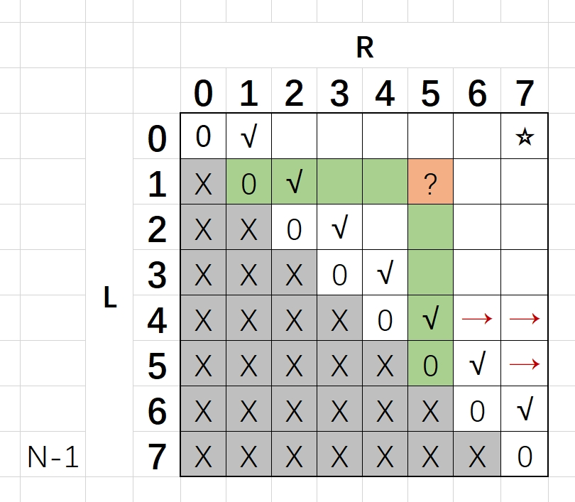
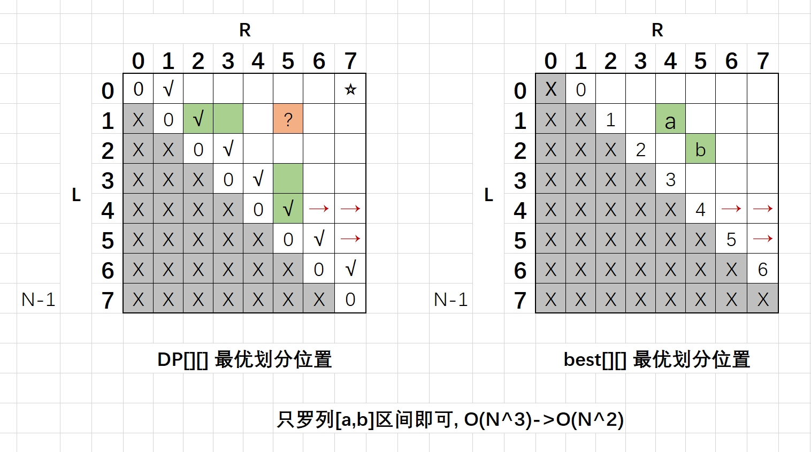
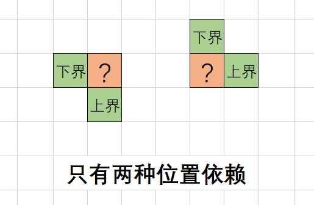
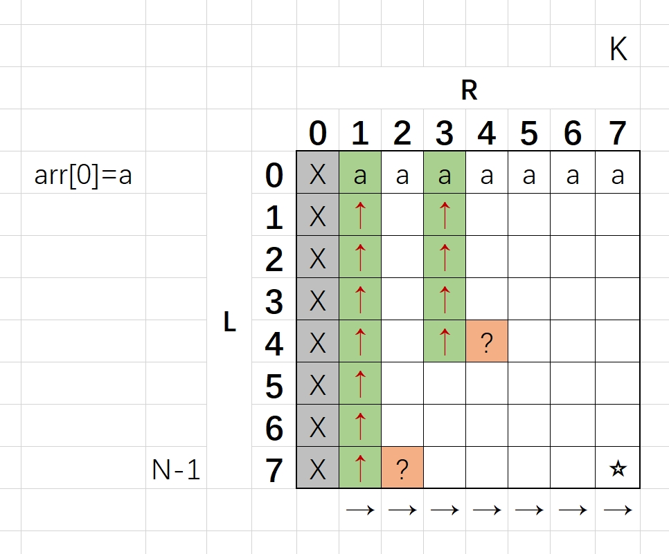
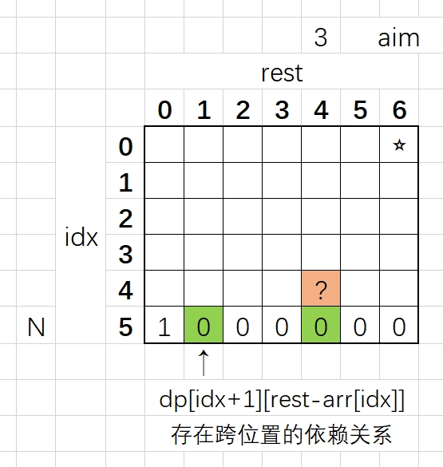

# 一、四边形不等式技巧[体系班41-42]

# 指标型题目-特征总结
**这一类题目**：求每个位置上的最差情况中最好、或最好情况中最差指标类问题。而且`此指标和数组区间的大小有单调性关系`，则非常可能都存在`划分界限的不回退现象`。利用划分界限的不回退机制，将枚举求解过程降低一阶。
```c++
// 题目形式：最差情况中最好、最好情况中最差
ans = max{min(左sum, 右sum)}
ans = min{max(左sum, 右sum)}
ans = 最优{最差(左某指标, 右某指标)}
ans = 最差{最优(左某指标, 右某指标)}
```
**关于证明**：不需要严格证明，只用对数器验证即可。

# 数组前缀和常见技巧
**前缀和常见技巧**：多补充一个0，之后R+1 - L求[L..R]范围内的sum。
```c++
vector<int> arr = {5,3,1,3};
vector<int> sum(arr.size(), 0);
for (int i = 0; i < arr.size(); i++) {
    sum[i + 1] = sum[i] + arr[i];
}
// arr =   [5,3,1,3]
// sum = [0,5,8,9,12]

// 使用方法：可以根据L和R快速计算出区间和
// arr[0...3]: sum[4] - sum[0]
// arr[1...2]: sum[3] - sum[1]
// arr[L...R]: sum[R+1] - sum[L]

vector<int> getSum(vector<int>& arr) {
    vector<int> sum(arr.size() + 1, 0);
    for (int i = 0; i < arr.size(); i++) {
        sum[i + 1] = sum[i] + arr[i];
    }
    return sum;
}

int getSumRange(vector<int>& sum, int L, int R) {
    return sum[R + 1] - sum[L];
}
```

# 题目1. 数组分割累加和(引子题目)
```python
给定一个非负数组arr，长度为N，那么有N-1种方案可以把arr切成左右两部分
每一种方案都有，min{左部分累加和，右部分累加和}
求这么多方案中，min{左部分累加和，右部分累加和}的最大值是多少？
整个过程要求时间复杂度O(N)
```

**最优解**：先求全局累加和，左部分不断右扩，在过程中找左右累加和最小的最大情况即可。

```c++
int getResult(vector<int>& arr) {
    if (arr == NULL || arr.size() < 2) {
        return 0;
    }
    int sum = 0;
    for (int& num : arr) { // 全部累加和 
        sum += num;
    }
    int leftSum = 0;
    int rightSum = 0;
    int ans = INT_MIN;
    for (int i = 0; i < arr.size(); i++) {
        leftSum += arr[i];
        rightSum = sum - leftSum;
        ans = max(ans, min(leftSum, rightSum)); // 抓取max
    }
    return ans;
}
```

# 题目2. 数组分割累加和指标数组(引子题目)
```python
第二问，上一步是在求全部数组的max{min(左sum, 右sum)}，在arr[0...N-1]上寻找最优划分。
但是现在对每一个下标i，都要找到arr[0...i]上的最优划分。
即ans[0,1,2,3,...,N-1]所有位置的答案。
```

**暴力解**：每一个范围arr[0...i]都进行罗列并重新划分，复杂度O(N^2)。

```c++
vector<int> getResult(vector<int>& arr) {
    vector<int> ans(arr.size(), INT_MIN);
    int sum = 0;
    for (int i = 0; i < arr.size(); i++) { // i作为右闭区间
        sum += arr[i]; // arr[0...i]上的累加和
        int leftSum = 0;
        int rightSum = 0;
        for (int j = 0; j <= i; j++) { // 对于每一个新的[0...i]区间都重新滑一遍
            leftSum += arr[j];
            rightSum = sum - leftSum;
            ans[i] = max(ans[i], min(leftSum, rightSum));
        }
    }
    return ans;
}
```

**最优解**：根据`不回退定理`以O(N)的复杂度生成ans数组。

首先证明，如果arr[0.....8)9.....17]上的最优划分是8，那么拓展到arr[0.....8..9.....18]上的最优划分只向右滑动，不回退。
1. 求arr[0...17]位置上的最优划分，从0开始滑到8位置，这个刀本身是不回退的：到达最优位置8 arr[0.....8)9.....17]，如果再往右滑动一个位置，一定会让结果变小。
2. 再求arr[0...18]位置上的最优划分，从8位置开始继续往右滑动，不需要回退，到达新的最优位置10 arr[0.....10)11.....18]。

**观察发现刀的运动规则**：[前]<=[后]要动，[前]>[后]就不能动了。因为有0的情况，所以必须在等于的时候也要动。

```c++
// 不回退机制实现O(N)

```

# 题目3. 石子合并问题[对数器]
```python
摆放着n堆石子。现要将石子有次序地合并成一堆规定每次只能选相邻的2堆石子合并成新的一堆，
并将新的一堆石子数记为该次合并的得分
求出将n堆石子合并成一堆的最小得分（或最大得分）合并方案
```

**思路**：考虑arr[L...R]上面怎么合最优，也就是最后的合成过程是合哪两个部分，需要一刀一刀的尝试。

**范围尝试模型**：典型题目，dp[L][R]代表[L...R]上面的最优合并代价。左下部分无效，对角线上因为本身只有一堆石子所以合并代价为0，右上对角线的数值为两两求和结果。

```c++
/* V1. 暴力递归 */
// 递归含义：返回L...R范围上的最小划分代价
int process(vector<int>& arr, vector<int> sum, int L, int R) {
    cout << L << " " << R << endl;
    if (L == R) { // 已经是一堆了，直接返回0
        return 0;
    }
    if (L + 1 == R) { // 相邻两个位置，合并代价只能是两者求和
        return arr[L] + arr[R];
    }
    int ans = INT_MAX;
    for (int i = L; i < R; i++) { // 以i为左区域的闭区间值，寻找L...R范围内的上一次最优划分
        int costPre = process(arr, sum, L, i) + process(arr, sum, i + 1, R); // 之前的划分代价 
        int costCur = getSumRange(sum, L, R); // 这次的划分代价
        ans = min(ans, costPre + costCur);
    }
    return ans;
    // 调用: process(arr, 0, N-1)
}
vector<int> getSum(vector<int>& arr) {
    vector<int> sum(arr.size() + 1, 0);
    for (int i = 0; i < arr.size(); i++) {
        sum[i + 1] = sum[i] + arr[i];
    }
    return sum;
}
int getSumRange(vector<int>& sum, int L, int R) {
    return sum[R + 1] - sum[L];
}
```

**动态规划**：依赖同行同列所有的有效值。复杂度为O(N^3)。
```c++
// dp[L][R]依赖分析: 左侧同行所有，下侧同列所有

// dp[L][L], dp[L+1][R]
// dp[L][L+1], dp[L+2][R]
// dp[L][L+2], dp[L+3][R]
// ...
// dp[L][R-1], dp[R][R]
```

```c++
/* V2. 动态规划-原始版本 */
int getResult(vector<int>& arr) {
    int N = arr.size();
    vector<int> sum = getSum(arr);
    vector<vector<int>> dp(N, vector<int>(N, 0));
    // L > R 情况下无需考虑
    // L == R 情况下dp = 0 
    for (int i = 0; i < N - 1; i++) { // 倒数第二条对角线
        dp[i][i + 1] = arr[i] + arr[i + 1];
    }
    // 其他位置格子填充
    for (int L = N - 3; L >= 0; L--) {
        for (int R = L + 2; R < N; R++) {
            int ans = INT_MAX;
            for (int i = L; i < R; i++) {
                int costPre = dp[L][i] + dp[i + 1][R];
                int costCur = getSumRange(sum, L, R);
                ans = min(ans, costPre + costCur);
            }
            dp[L][R] = ans;
        }
    }
    return dp[0][N - 1];
}
```



**优化思路**：以dp[3][17]为例，枚举所有值需要尝试以下所有分组(dp[3][3], dp[4][17]), (3-4, 5-17), (3-5, 6-17), ..., (3-16, 17-17)所有值。观察此位置依赖，左侧为dp[3][16]，下侧为dp[4][17]，如果dp[3][16]最优划分在8-9之间，如果dp[4][17]最优划分在12-13之间，可否只枚举9-12位置即可？通过制造`上界`和`下界`来节省掉大量的枚举操作。

**优化细节**：设计一个best[L][R]数组，存放每个dp[L][R]位置最优划分代价的划分位置。当L==R时dp=0，没有划分点，没有任何意义直接跳过。当L==R-1时第二条对角线，此时定义最优划分位置为L。

```c++
/* V3. 动态规划-四边形不等式 */
int getResult(vector<int>& arr) {
    int N = arr.size();
    vector<int> sum = getSum(arr);
    vector<vector<int>> dp(N, vector<int>(N, 0));
    vector<vector<int>> best(N, vector<int>(N, 0)); // 存放一个范围上的最好划分界限，左边区域的最右边界
    for (int i = 0; i < N - 1; i++) { // 倒数第二条对角线
        dp[i][i + 1] = arr[i] + arr[i + 1];
        best[i][i + 1] = i; // 相邻两个数字的最优划分点在L
    }
    // 其他位置格子填充
    for (int L = N - 3; L >= 0; L--) {
        for (int R = L + 2; R < N; R++) {
            int ans = INT_MAX;
            /* ******************** 四边形不等式优化 ******************** */
            int leftBound = best[L][R - 1];
            int rightBound = best[L + 1][R];
            int pos = -1; // 记录下来给best[L][R]
            for (int i = leftBound; i <= rightBound; i++) { // 构造上界和下界，省略枚举
                int costPre = dp[L][i] + dp[i + 1][R];
                int costCur = getSumRange(sum, L, R);
                if (ans > costPre + costCur) { // 发现了新的有效位置
                    ans = costPre + costCur;
                    pos = i;
                }
            }
            best[L][R] = pos; // 填好这个位置的最优划分
            dp[L][R] = ans;
            /* ******************** 四边形不等式优化 ******************** */
        }
    }
    return dp[0][N - 1];
}
```


**四边形不等式技巧优化与特征**：符合以下五个条件的动态规划问题，可以使用四边形不等式技巧优化。优化的效益是将计算复杂度降低一阶，若是二维DP问题则可以从O(N^3)降低到O(N^2)。不需要证明（证明太难而且每道题都不一样），使用对数器验证即可。
1. 两个可变参数的区间划分问题
2. 每个格子有枚举行为
3. 当两个可变参数固定一个，另一个参数和答案之间存在单调性关系
4. 往往是反向单调关系
5. 枚举加速的位置对：[上+右] 或者 [左+下]



# 题目4. 410.分割数组的最大值(画匠问题)[Hard]
https://leetcode.cn/problems/split-array-largest-sum/

```python
# 左神版本
给定一个整型数组 arr，数组中的每个值都为正数，表示完成一幅画作需要的时间，再 给定 一个整数 num，表示画匠的数量，每个画匠只能画连在一起的画作。所有的画家 并行工作，请 返回完成所有的画作需要的最少时间。【举例】
arr=[3,1,4]，num=2。
最好的分配方式为第一个画匠画 3 和 1，所需时间为 4。第二个画匠画 4，所需时间 为 4。 因为并行工作，所以最少时间为 4。如果分配方式为第一个画匠画 3，所需时 间为 3。第二个画 匠画 1 和 4，所需的时间为 5。那么最少时间为 5，显然没有第一 种分配方式好。所以返回 4。
arr=[1,1,1,4,3]，num=3。
最好的分配方式为第一个画匠画前三个 1，所需时间为 3。第二个画匠画 4，所需时间 为 4。 第三个画匠画 3，所需时间为 3。返回 4。
```

```python
# LeetCode
给定一个非负整数数组 nums 和一个整数 m ，你需要将这个数组分成 m 个非空的连续子数组。
设计一个算法使得这 m 个子数组各自和的最大值最小。
```

```c++
/* V1. 暴力递归 */
// 含义：arr数组[0...idx]上面给k个画家，返回画完的最短时间
int process(vector<int>& arr, vector<int>& sum, int idx, int k) {
    if (k == 0) { // 这里一定是k在前面，因为k=0时，idx为多少都是无意义，没法画
        return INT_MAX;
    }
    if (idx == 0) { // 只有1个画作时，在k>0的情况下，多少个画家都没用
        return arr[idx];
    }
    /* 给最后一个画家思考：我要画哪个区间？
       情况1: 我不画， max(0, process(arr, idx, k-1))
       情况2: 我画1个，max(arr[idx], process(arr, idx-1, k-1))
       情况3: 我画2个，max(arr[idx-1]+arr[idx], process(arr, idx-2, k-1))
       情况4: 我画3个，max(arr[idx-2]+arr[idx-1]+arr[idx], process(arr, idx-3, k-1))
       ...
       情况4: 我画全部，max(arr[0...idx], 0) */
    int ans1 = max(0, process(arr, sum, idx, k - 1)); // 我不画
    int ans2 = max(getSumRange(sum, 0, idx), 0); // 我全画
    int ans = min(ans1, ans2);
    for (int i = idx; i > 0; i--) { // 我画部分
        int preTime = process(arr, sum, i - 1, k - 1); // 剩下的画作，k-1个人去分
        int curTime = getSumRange(sum, i, idx); // 我分到的画作
        ans = min(ans, max(preTime, curTime));
    }
    return ans;
}
int splitArray1(vector<int>& nums, int k) {
    vector<int> sum = getSum(nums);
    return process(nums, sum, nums.size() - 1, k);
}
```

```c++
/* V2. 傻缓存版本 */
// 击败 5.40%
int process1(vector<int>& arr, vector<int>& sum, int idx, int k, vector<vector<int>>& dp) {
    if (k == 0) return INT_MAX;
    if (idx == 0) return arr[idx];
    // 缓存表检测
    if (dp[idx][k] != -1) {
        return dp[idx][k];
    }
    int ans = min(process1(arr, sum, idx, k - 1, dp), getSumRange(sum, 0, idx)); // 我不画 V.S. 我全画
    for (int i = idx; i > 0; i--) { // 我画部分
        int preTime = process1(arr, sum, i - 1, k - 1, dp); // 剩下的画作，k-1个人去分
        int curTime = getSumRange(sum, i, idx); // 我分到的画作
        ans = min(ans, max(preTime, curTime));
    }
    // 缓存表记录
    dp[idx][k] = ans;
    return ans;
}
int splitArray(vector<int>& nums, int k) {
    vector<int> sum = getSum(nums);
    vector<vector<int>> dp(nums.size(), vector<int>(k + 1, -1)); // 傻缓存全部填写-1
    return process1(nums, sum, nums.size() - 1, k, dp);
}
```

```c++
/* V3. 动态规划-无优化 */
// 击败 20.28%
int splitArray(vector<int>& arr, int K) {
    int N = arr.size();
    vector<int> sum = getSum(arr);
    vector<vector<int>> dp(N, vector<int>(K + 1, 0));
    for (int idx = 0; idx < N; idx++) { // basecase 1
        dp[idx][0] = INT_MAX;
    }
    for (int k = 1; k <= K; k++) { // basecase 2
        dp[0][k] = arr[0];
    }
    for (int k = 1; k <= K; k++) {
        for (int idx = N - 1; idx > 0; idx--) {
            // 逻辑和暴力递归完全一致
            int ans = min(dp[idx][k - 1], getSumRange(sum, 0, idx));
            for (int i = idx; i > 0; i--) { // 我画部分
                int preTime = dp[i - 1][k - 1]; // 剩下的画作，k-1个人去分
                int curTime = getSumRange(sum, i, idx); // 我分到的画作 
                ans = min(ans, max(preTime, curTime));
            }
            dp[idx][k] = ans;
        }
    }
    return dp[N - 1][K];
}
```



```c++
/* V4. 动态规划-四边形不等式 */
// 这个也太复杂了...(有后期的简化版本)
int splitArray(vector<int>& arr, int K) {
    int N = arr.size();
    vector<int> sum = getSum(arr);
    vector<vector<int>> dp(N, vector<int>(K + 1, 0));
    vector<vector<int>> best(N, vector<int>(K + 1, 0)); // 前面的所有人负责的最右闭区间边界
    for (int idx = 0; idx < N; idx++) { // basecase 1 第一列
        dp[idx][0] = INT_MAX;
    }
    for (int k = 1; k <= K; k++) { // basecase 2 第一行
        dp[0][k] = arr[0];
        best[0][k] = 0; // 自己闲着，0号画作给前面的人
    }
    for (int idx = N-1; idx > 0; idx--) { // 想要使用四边形不等式必须填好这一列
        dp[idx][1] = getSumRange(sum, 0, idx);
        best[idx][0] = -1; // 我全部都画，所以前面的画家不画，因此是-1
    }
    for (int k = 2; k <= K; k++) {
        // 单独处理最下面的格子，因为没有上限。
        int down = best[N-1][k];
        int ans = INT_MAX;
        int bestChoose = -1;
        for (int leftEnd = down; leftEnd < N; leftEnd++) {
            int leftCost = leftEnd == -1 ? 0 : dp[leftEnd][k-1];
            int rightCost = leftEnd == N-1 ? 0 : getSumRange(sum, leftEnd+1, N-1);
            int cur = max(leftCost, rightCost);
            if (cur < ans) {
                ans = cur;
                bestChoose = leftEnd;
            }
        }
        dp[N-1][k] = ans;
        best[N-1][k] = bestChoose;

        // 开始处理普适位置
        int up = 0;
        for (int idx = N - 2; idx > 0; idx--) {
            down = best[idx][k-1];
            up = best[idx+1][k];
            int ans = INT_MAX;
            int bestChoose = -1;
            for (int leftEnd = down; leftEnd < N; leftEnd++) {
                int leftCost = leftEnd == -1 ? 0 : dp[leftEnd][k-1];
                int rightCost = leftEnd == idx ? 0 : getSumRange(sum, leftEnd+1, idx);
                int cur = max(leftCost, rightCost);
                if (cur < ans) {
                    ans = cur;
                    bestChoose = leftEnd;
                }
            }
            dp[idx][k] = ans;
            best[idx][k] = bestChoose;
        }
    }
    return dp[N - 1][K];
}
```

# 题目5. 邮局选址问题

```python
一条直线上有居民点，邮局只能建在居民点上。给定一个有序正数数组arr，每个值表示 居民点的一维坐标，再给定一个正数 num，表示邮局数量。选择num个居民点建立num个 邮局，使所有的居民点到最近邮局的总距离最短，返回最短的总距离   
【举例】   
arr=[1,2,3,4,5,1000]，num=2。   
第一个邮局建立在 3 位置，第二个邮局建立在 1000 位置。那么 1 位置到邮局的距离 为 2， 2 位置到邮局距离为 1，3 位置到邮局的距离为 0，4 位置到邮局的距离为 1， 5 位置到邮局的距 离为 2，1000 位置到邮局的距离为 0。这种方案下的总距离为 6， 其他任何方案的总距离都不会 比该方案的总距离更短，所以返回6
```

# 题目6. 887.鸡蛋掉落(丢棋子问题)[Hard]

https://leetcode.cn/problems/super-egg-drop/description/

```python
一座大楼有 0~N 层，地面算作第 0 层，最高的一层为第 N 层。已知棋子从第 0 层掉落肯定 不会摔碎，从第 i 层掉落可能会摔碎，也可能不会摔碎(1≤i≤N)。给定整数 N 作为楼层数， 再给定整数 K 作为棋子数，返 回如果想找到棋子不会摔碎的最高层数，即使在最差的情况下扔 的最少次数。一次只能扔一个棋子。
```

# 二、状态压缩DP[体系班43]
把线性结构压缩成更精简的整型位信息结构，指示一个集合中某个元素存与否。但是其实本质上还是线性结构。

# 题目7. 464.我能赢吗

# 题目8. TSP问题

# 题目9. 铺瓷砖问题

# 三、DC3算法[体系班43]

**后缀字符串定义**：从某一个位置开始，一直取到最末尾位置，称为后缀字符串。

**字典序排序**：相同位数情况下，按照进制开看待，第一个不同位的数字越大则字典序越大；位数不同情况下，将短的字符串补上0，`aaa<b00`。

**后缀数组**：对于一个字符串，从每一位i开始生成所有后缀字符串；对所有后缀字符串进行字典序排序后，i生成的排序数组称为后缀数组。因为后缀串长度都不一致，所以不可能有相同的两个相同的后缀字符串。

**暴力生成后缀数组**：生成所有后缀串复杂度为O(N^2)、排序N个字符串需要O(N^2*logN)，因为排序代价是O(N*logN)但是每次两两比较就需要O(N)。

**DC3算法**：能够以O(N)的复杂度生成后缀数组。

1. 桶排序算法做为基元函数：对于一个数据三元组，每个数字的值都不大，可以按照3个维度进行桶排序以O(N)的复杂度完成排序。
2. 字符串生成后缀数组等价于数组生成后缀数组。


<!--  -->


